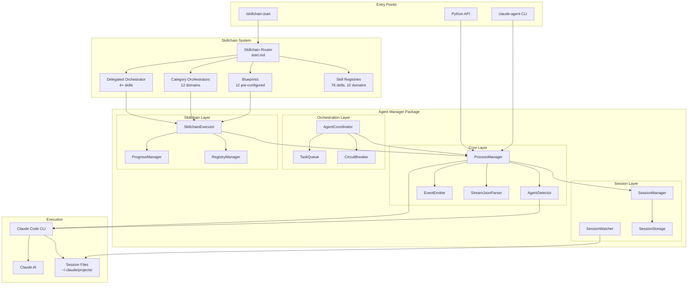
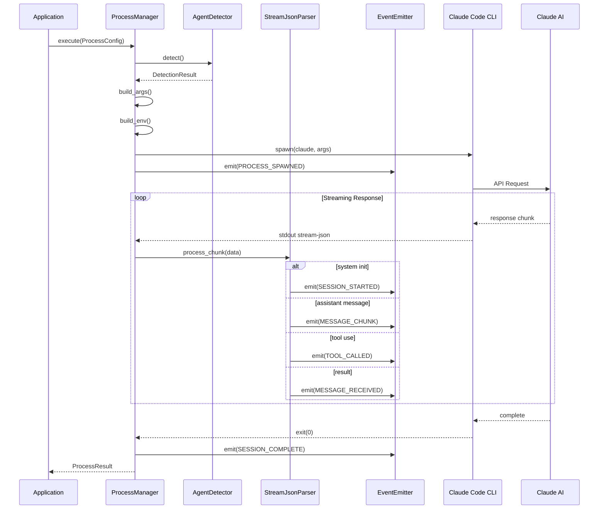
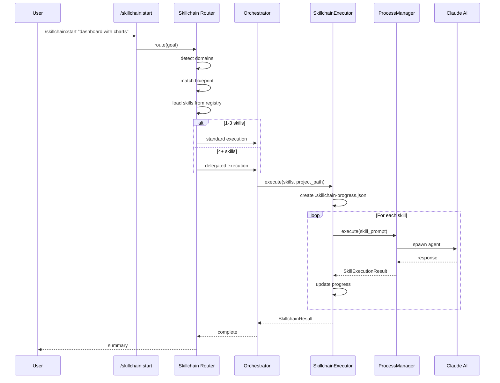
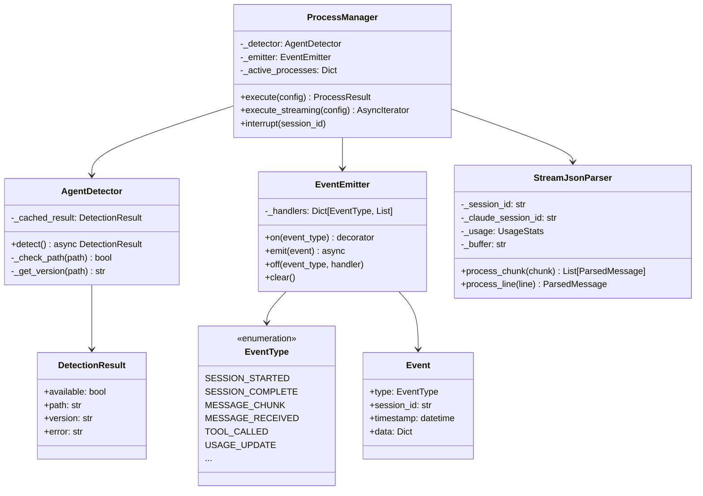
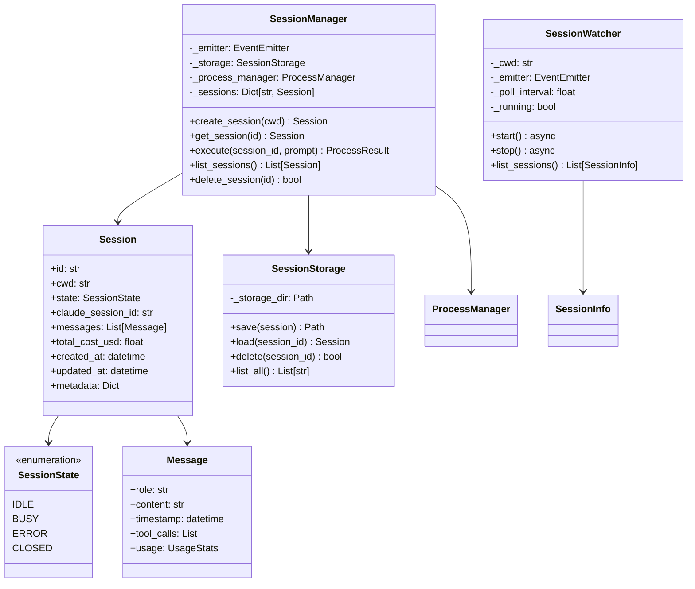
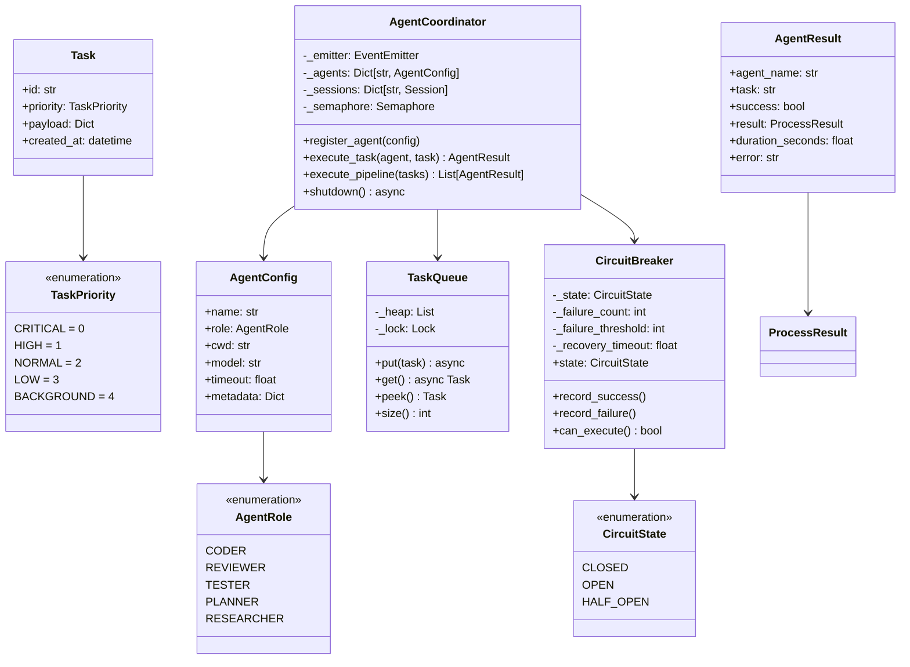
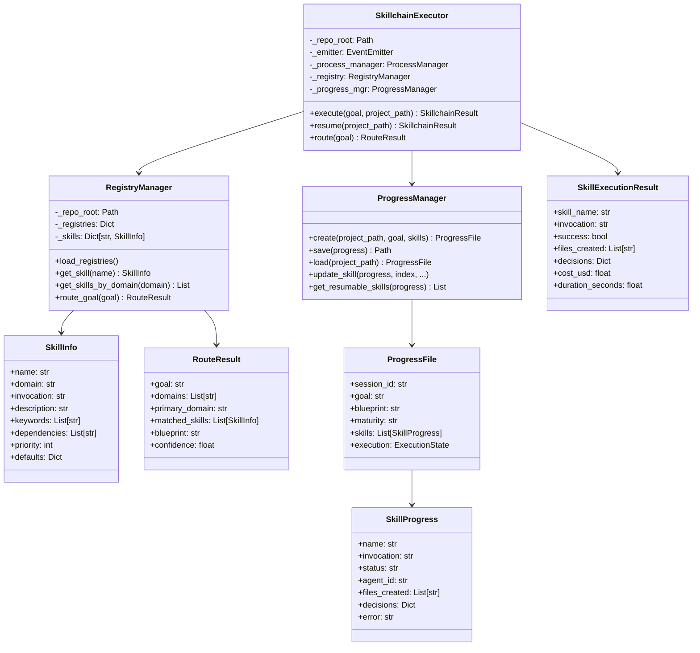
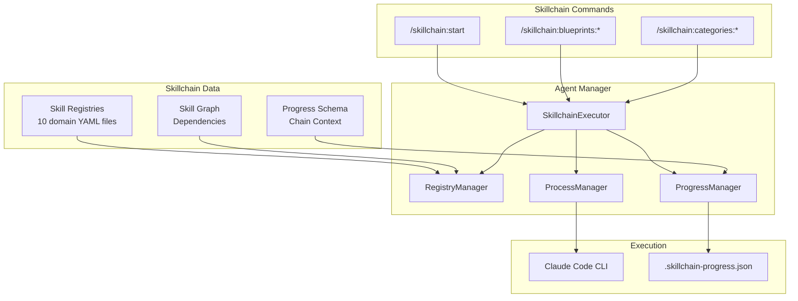
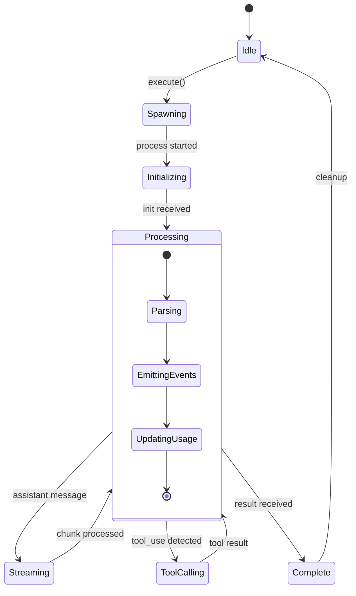

# Architecture

This document provides comprehensive architecture diagrams showing how all components of the agent ecosystem work together, from the skillchain entry point through to Claude AI execution.

## System Overview



## Component Data Flow

### Process Execution Flow



### Skillchain Execution Flow



## Module Architecture

### Core Module



### Session Module



### Orchestration Module



### Skillchain Module



## Integration Architecture

### Skillchain + Agent Manager Integration



### File System Layout

```
~/.claude/
├── projects/                    # Session files by project
│   └── -Users-you-project/      # Encoded project path
│       ├── abc123.jsonl         # Session 1
│       └── def456.jsonl         # Session 2
│
└── skillchain-data/             # Skillchain data (NOT commands)
    ├── registries/              # Skill definitions
    └── shared/                  # Schemas, protocols

~/.claude_agent_manager/
└── sessions/                    # Agent manager persistence
    └── session-abc123.json

/your/project/
└── .skillchain-progress.json    # Active skillchain state
```

## Event Flow



## Next Steps

- [Skillchain Integration](./skillchain-integration) - Deep dive into skill execution
- [Real-World Usage](./real-world-usage) - Practical examples
- [CLI Reference](./cli-reference) - Command-line interface
