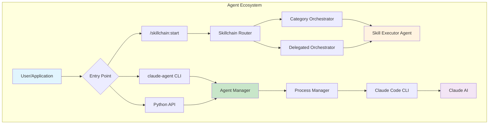
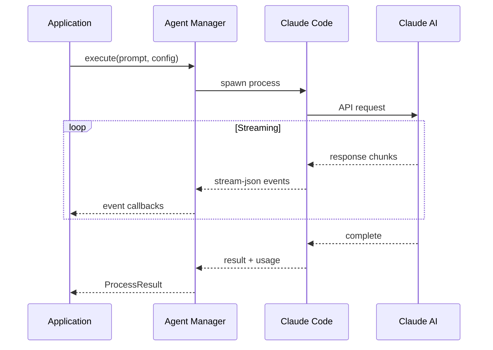
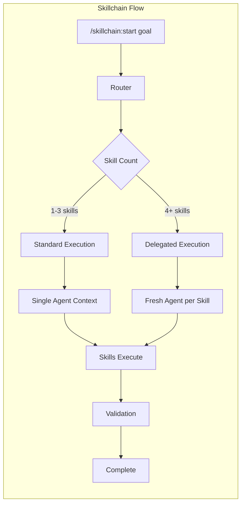

# Agents Overview

AI agents are a core architectural pattern in the ai-design-components ecosystem. They enable automated, intelligent task execution across the 76 skills, providing programmatic access to Claude's capabilities for complex multi-step workflows.

## What are Agents?

In this ecosystem, **agents** are autonomous Claude instances that can:

- Execute skills and blueprints programmatically
- Spawn sub-agents for delegated work
- Maintain context across multi-step workflows
- Track progress and persist state
- Coordinate with other agents in pipelines



## Agent Types

### 1. Interactive Agents (Claude Code)

The standard Claude Code experience - interactive conversations in terminal or IDE:

```bash
# Direct interaction
claude

# Interactive with working directory
claude --cwd /my/project
```

### 2. Batch Agents (Programmatic)

Non-interactive agents spawned via `--print` mode for automation:

```bash
# Single prompt, exit after response
claude --print "Explain this code" --output-format stream-json
```

### 3. Skill Executor Agents

Specialized agents that execute individual skills with fresh context:

```
/skillchain:start dashboard with charts
→ Routes to frontend orchestrator
→ Spawns skill executor for each skill:
  1. theming-components executor
  2. designing-layouts executor
  3. creating-dashboards executor
  4. visualizing-data executor
```

### 4. Orchestrator Agents

Coordinate multiple executor agents:

- **Category Orchestrators**: Domain-specific (frontend, backend, devops)
- **Delegated Orchestrator**: Manages long chains (4+ skills) with fresh context per skill
- **Multi-Domain Orchestrator**: Cross-cutting workflows

## Agent Architecture

```mermaid
flowchart TB
    subgraph "Application Layer"
        APP[Your Application]
        CLI[claude-agent CLI]
        SC[/skillchain:start]
    end

    subgraph "Orchestration Layer"
        COORD[AgentCoordinator]
        QUEUE[TaskQueue]
        CB[CircuitBreaker]
    end

    subgraph "Management Layer"
        PM[ProcessManager]
        SM[SessionManager]
        SE[SkillchainExecutor]
    end

    subgraph "Core Layer"
        DET[AgentDetector]
        PAR[StreamJsonParser]
        EVT[EventEmitter]
    end

    subgraph "Execution Layer"
        CC[Claude Code CLI]
        CLAUDE[Claude AI]
    end

    APP --> COORD
    CLI --> PM
    SC --> SE

    COORD --> QUEUE
    COORD --> CB
    COORD --> PM

    SE --> PM
    PM --> SM
    PM --> DET
    PM --> PAR
    PM --> EVT

    DET --> CC
    PAR --> CC
    CC --> CLAUDE
```

## Integration Points

### Entry Points

| Entry Point | Use Case | Example |
|-------------|----------|---------|
| `/skillchain:start` | Interactive skill chains | `/skillchain:start dashboard` |
| `claude-agent` CLI | Command-line automation | `claude-agent run "Write tests"` |
| Python API | Programmatic integration | `ProcessManager().execute(config)` |

### Data Flow



## Agent Manager Package

The **Claude Agent Manager** (`claude_agent_manager`) is the Python library that provides programmatic control over agents:

```python
from claude_agent_manager import (
    # Core - spawn and control agents
    ProcessManager,
    ProcessConfig,
    EventEmitter,
    EventType,

    # Sessions - track conversations
    SessionManager,
    SessionWatcher,

    # Orchestration - coordinate agents
    AgentCoordinator,
    TaskQueue,
    CircuitBreaker,

    # Skillchain - execute skills
    SkillchainExecutor,
    ProgressManager,
)
```

### Quick Example

```python
import asyncio
from claude_agent_manager import ProcessManager, ProcessConfig, EventEmitter, EventType

async def main():
    emitter = EventEmitter()

    @emitter.on(EventType.MESSAGE_CHUNK)
    async def on_chunk(event):
        print(event.data['chunk'], end='', flush=True)

    manager = ProcessManager(emitter=emitter)

    result = await manager.execute(ProcessConfig(
        prompt="Write a hello world function",
        cwd="/my/project"
    ))

    print(f"\nCost: ${result.usage.total_cost_usd:.4f}")
    print(f"Session: {result.claude_session_id}")

asyncio.run(main())
```

## Skillchain + Agents

The skillchain system leverages agents for automated skill execution:



### Programmatic Skillchain Execution

```python
from claude_agent_manager import SkillchainExecutor

executor = SkillchainExecutor("/path/to/ai-design-components")

# Preview what skills would be matched
route = executor.route("dashboard with charts and postgres")
print(f"Matched {len(route.matched_skills)} skills")
print(f"Execution mode: {'delegated' if len(route.matched_skills) >= 4 else 'standard'}")

# Execute the skillchain
result = await executor.execute(
    goal="Build a sales dashboard",
    project_path="/my/project",
    blueprint="dashboard",
    maturity="intermediate"
)

print(f"Completed: {result.skills_completed}/{result.skills_planned}")
print(f"Files: {result.total_files_created}")
```

## Next Steps

- [Agent Manager](./manager-overview) - Deep dive into the manager package
- [Architecture](./architecture) - System design and data flow
- [Skillchain Integration](./skillchain-integration) - Using agents with skillchain
- [Real-World Usage](./real-world-usage) - Practical examples
