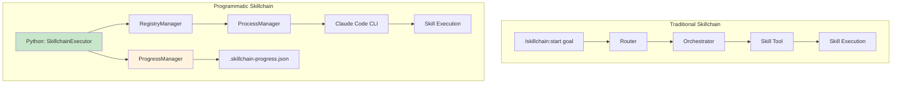
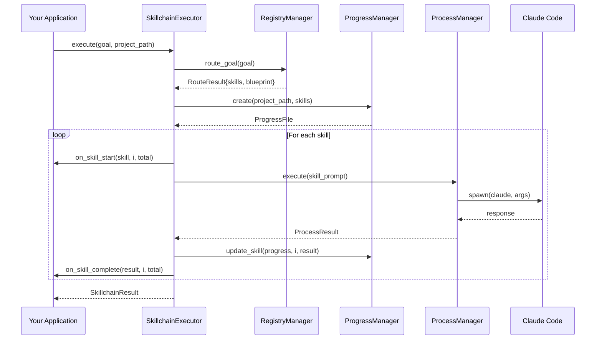
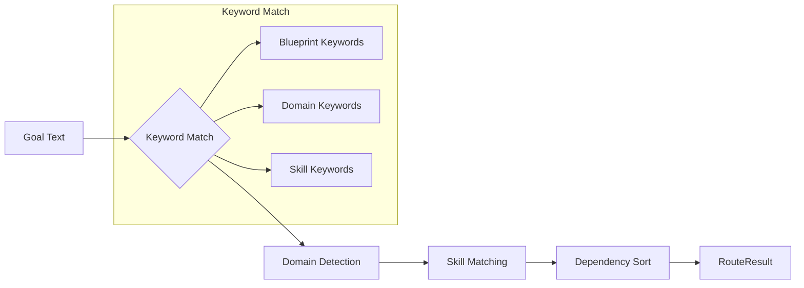

# Skillchain Integration

The Claude Agent Manager provides deep integration with the Skillchain system, enabling programmatic execution of skill chains with progress tracking, context passing, and resume capabilities.

## Overview



## The Integration Bridge

### What SkillchainExecutor Provides

| Feature | Traditional | Programmatic |
|---------|-------------|--------------|
| Entry Point | `/skillchain:start` | `executor.execute()` |
| Skill Routing | Interactive | Automatic via RegistryManager |
| Progress Tracking | Manual checkpoints | Automatic via ProgressManager |
| Resume Capability | `/skillchain:resume` | `executor.resume()` |
| Callbacks | None | `on_skill_start`, `on_skill_complete` |
| Cost Tracking | Displayed | Returned in result |

### Data Flow



## Using SkillchainExecutor

### Basic Execution

```python
import asyncio
from claude_agent_manager import SkillchainExecutor

async def main():
    # Initialize with path to ai-design-components repo
    executor = SkillchainExecutor("/path/to/ai-design-components")

    # Execute a skillchain
    result = await executor.execute(
        goal="Build a dashboard with charts and tables",
        project_path="/my/project",
        maturity="intermediate"
    )

    print(f"Completed: {result.skills_completed}/{result.skills_planned}")
    print(f"Files created: {len(result.total_files_created)}")
    print(f"Total cost: ${result.total_cost_usd:.4f}")

asyncio.run(main())
```

### Using Blueprints

```python
# Execute with a specific blueprint
result = await executor.execute(
    goal="Build a sales dashboard",
    project_path="/my/project",
    blueprint="dashboard",  # Uses dashboard blueprint skills
    maturity="intermediate"
)
```

Available blueprints:
- `dashboard` - UI dashboard with charts, tables, KPI cards
- `crud-api` - REST API with database and authentication
- `rag-pipeline` - RAG pipeline with vector DB and embeddings
- `ci-cd` - CI/CD pipeline with GitHub Actions
- `k8s` - Kubernetes deployment with Helm
- `security` - Security hardening and compliance
- `observability` - Monitoring, logging, and tracing
- `data-pipeline` - ETL/ELT data pipeline
- `ml-pipeline` - MLOps pipeline for model training
- `cloud` - Cloud infrastructure (AWS/GCP/Azure)
- `cost` - FinOps cost optimization
- `api-first` - API-first design with OpenAPI

### With Progress Callbacks

```python
def on_skill_start(skill, index, total):
    print(f"[{index + 1}/{total}] Starting: {skill.name}")
    print(f"  Invocation: {skill.invocation}")

def on_skill_complete(result, index, total):
    if result.success:
        print(f"[{index + 1}/{total}] Complete: {result.skill_name}")
        print(f"  Cost: ${result.cost_usd:.4f}")
        print(f"  Files: {result.files_created}")
    else:
        print(f"[{index + 1}/{total}] FAILED: {result.skill_name}")
        print(f"  Error: {result.error}")

result = await executor.execute(
    goal="Build API with auth",
    project_path="/my/project",
    on_skill_start=on_skill_start,
    on_skill_complete=on_skill_complete
)
```

### Previewing Skill Routing

```python
# Preview what skills would be matched without executing
route = executor.route("dashboard with charts and postgres")

print(f"Detected blueprint: {route.blueprint}")
print(f"Confidence: {route.confidence * 100:.0f}%")
print(f"Domains: {route.domains}")
print(f"Primary domain: {route.primary_domain}")
print(f"Matched skills ({len(route.matched_skills)}):")
for skill in route.matched_skills:
    print(f"  - {skill.name} ({skill.invocation})")
    if skill.dependencies:
        print(f"    deps: {skill.dependencies}")
```

### Resuming Interrupted Chains

```python
from claude_agent_manager import ProgressManager

# Check if there's an interrupted chain
pm = ProgressManager()
progress = pm.load("/my/project")

if progress and pm.get_resumable_skills(progress):
    print(f"Found interrupted chain: {progress.goal}")
    print(f"Remaining skills: {len(pm.get_resumable_skills(progress))}")

    # Resume execution
    result = await executor.resume(
        project_path="/my/project",
        on_skill_start=on_skill_start,
        on_skill_complete=on_skill_complete
    )
```

## Progress Tracking

### Progress File Structure

The `.skillchain-progress.json` file tracks execution state:

```json
{
  "version": "1.0",
  "session_id": "abc123-def456",
  "goal": "Build a dashboard with charts",
  "blueprint": "dashboard",
  "maturity": "intermediate",
  "project_path": "/my/project",
  "started_at": "2025-12-10T10:00:00Z",
  "updated_at": "2025-12-10T10:15:00Z",
  "skills": [
    {
      "name": "theming-components",
      "invocation": "ui-foundation-skills:theming-components",
      "status": "complete",
      "agent_id": "executor-0",
      "files_created": ["src/tokens.css", "src/theme.ts"],
      "decisions": {
        "color_scheme": "blue-gray",
        "theme_modes": ["light", "dark"]
      }
    },
    {
      "name": "creating-dashboards",
      "invocation": "ui-data-skills:creating-dashboards",
      "status": "running",
      "agent_id": "executor-1",
      "files_created": [],
      "decisions": {}
    },
    {
      "name": "visualizing-data",
      "invocation": "ui-data-skills:visualizing-data",
      "status": "pending",
      "agent_id": null,
      "files_created": null,
      "decisions": null
    }
  ],
  "execution": {
    "mode": "standard",
    "total_skills": 5,
    "completed_count": 1,
    "failed_count": 0,
    "skipped_count": 0,
    "current_index": 1,
    "activation_rate": 1.0
  }
}
```

### Programmatic Progress Management

```python
from claude_agent_manager import ProgressManager

pm = ProgressManager()

# Load existing progress
progress = pm.load("/my/project")

# Check status
print(f"Goal: {progress.goal}")
print(f"Completed: {progress.execution.completed_count}")
print(f"Failed: {progress.execution.failed_count}")
print(f"Current: {progress.get_current_skill().name}")

# Get previous outputs for context
outputs = progress.get_previous_outputs()
for skill_name, data in outputs.items():
    print(f"{skill_name}: {data['files']}")
```

## Skill Registry Integration

### How Skills Are Matched



### Registry Structure

The `RegistryManager` loads from `.claude-commands/skillchain-data/registries/`:

```yaml
# frontend.yaml
domain: frontend
description: "UI components and interactions"

skills:
  theming-components:
    group: foundation
    priority: 1
    required: true
    keywords:
      primary: [theme, colors, brand, styling, tokens, dark mode]
      secondary: [palette, design system, css variables]
    invocation: "ui-foundation-skills:theming-components"
    dependencies: []

  creating-dashboards:
    group: data
    priority: 3
    required: false
    keywords:
      primary: [dashboard, kpi, metrics, analytics, widgets]
    invocation: "ui-data-skills:creating-dashboards"
    dependencies: [theming-components, designing-layouts]
```

### Skill Invocation Protocol

Each skill is invoked using the 4-step protocol:

```python
# The prompt sent to Claude for each skill
prompt = f"""
Execute this skill completely following the execution protocol.

## SKILL TO EXECUTE
Name: {skill.name}
Invocation: Skill: {skill.invocation}

## CONTEXT
Goal: {progress.goal}
Blueprint: {progress.blueprint or "None"}
Maturity: {maturity}
Project: {progress.project_path}

## PREVIOUS SKILL OUTPUTS
{previous_outputs}

## EXECUTION PROTOCOL

### Step 1: Announce
Say: "Now invoking skill: {skill.name}"

### Step 2: Invoke
Use the Skill tool with: {skill.invocation}

### Step 3: Complete
Follow ALL instructions from the skill's SKILL.md file.

### Step 4: Report
When complete, report:
- FILES_CREATED: [list files]
- KEY_DECISIONS: [list decisions]
- STATUS: complete

Now execute the skill.
"""
```

## CLI Commands

### Skillchain CLI

```bash
# List available blueprints
claude-agent skillchain blueprints

# Preview skill routing
claude-agent skillchain route "dashboard with charts"

# Execute a skillchain
claude-agent skillchain run "Build a REST API" --project /my/project

# Execute with blueprint
claude-agent skillchain run "sales dashboard" --blueprint dashboard

# Check progress
claude-agent skillchain status --project /my/project

# Resume interrupted chain
claude-agent skillchain resume --project /my/project
```

### Output Example

```bash
$ claude-agent skillchain route "dashboard with charts and postgres"

Skill Routing for: dashboard with charts and postgres

Detected Blueprint: dashboard (confidence: 75%)

Detected Domains:
  * frontend
    backend

Matched Skills (5):
  1. theming-components
     Invocation: ui-foundation-skills:theming-components
  2. visualizing-data
     Invocation: ui-data-skills:visualizing-data
     Dependencies: theming-components
  3. creating-dashboards
     Invocation: ui-data-skills:creating-dashboards
     Dependencies: theming-components, designing-layouts
  4. using-relational-databases
     Invocation: backend-data-skills:using-relational-databases
  5. assembling-components
     Invocation: ui-assembly-skills:assembling-components
     Dependencies: *

Execution Mode: delegated
```

## Best Practices

### 1. Use Blueprints for Common Patterns

```python
# Instead of relying on keyword matching
result = await executor.execute(
    goal="Build API",
    blueprint="crud-api"  # Ensures consistent skill selection
)
```

### 2. Implement Progress Callbacks for Visibility

```python
def on_skill_start(skill, i, total):
    logger.info(f"[{i+1}/{total}] Starting {skill.name}")

def on_skill_complete(result, i, total):
    if result.success:
        metrics.record_skill_completion(result.skill_name, result.cost_usd)
    else:
        alerts.send_skill_failure(result.skill_name, result.error)
```

### 3. Handle Resume for Long-Running Chains

```python
async def execute_with_retry(executor, goal, project_path, max_retries=3):
    for attempt in range(max_retries):
        try:
            pm = ProgressManager()
            if pm.exists(project_path):
                return await executor.resume(project_path)
            else:
                return await executor.execute(goal, project_path)
        except Exception as e:
            if attempt == max_retries - 1:
                raise
            logger.warning(f"Attempt {attempt + 1} failed: {e}")
```

### 4. Validate Before Execution

```python
# Preview first
route = executor.route(goal)

if len(route.matched_skills) == 0:
    raise ValueError("No skills matched the goal")

if len(route.matched_skills) > 10:
    logger.warning("Large skill chain detected, consider breaking down")

# Then execute
result = await executor.execute(goal, project_path)
```

## Next Steps

- [Real-World Usage](./real-world-usage) - Practical examples and patterns
- [CLI Reference](./cli-reference) - Complete command reference
- [Architecture](./architecture) - System design details
