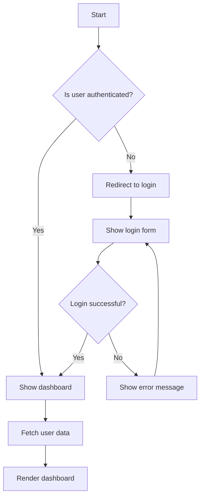
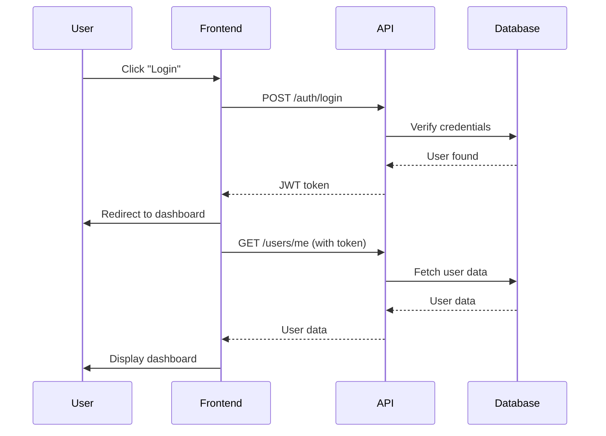
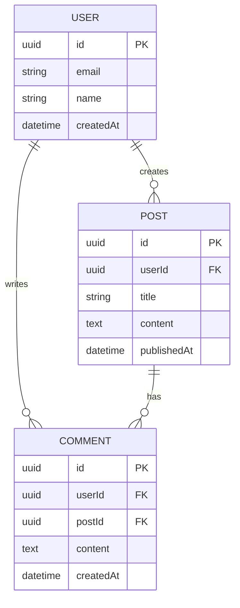
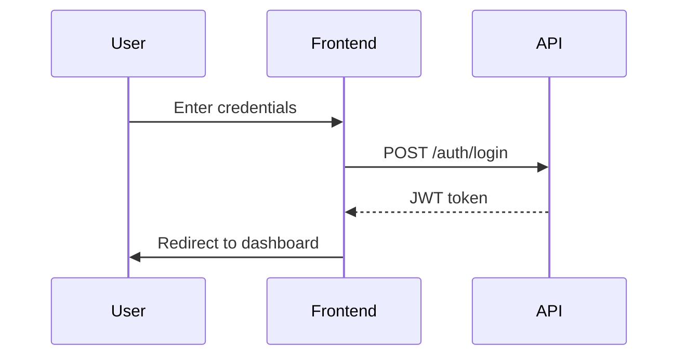
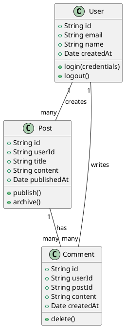
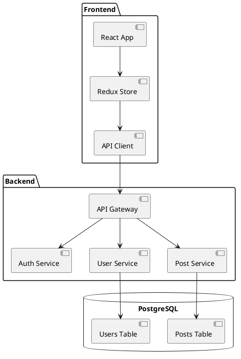

# Documentation Generation Skill - Master Plan

**Skill Name:** `documentation-generation`
**Skill Level:** Mid Level (5,000-8,000 tokens)
**Status:** Planning Phase (init.md complete, SKILL.md to be created)
**Last Updated:** December 3, 2025

---

## Table of Contents

1. [Strategic Positioning](#strategic-positioning)
2. [Skill Purpose and Scope](#skill-purpose-and-scope)
3. [Research Findings](#research-findings)
4. [Documentation Taxonomy](#documentation-taxonomy)
5. [Decision Frameworks](#decision-frameworks)
6. [API Documentation Patterns](#api-documentation-patterns)
7. [Code Documentation Patterns](#code-documentation-patterns)
8. [Documentation Sites](#documentation-sites)
9. [Architecture Decision Records (ADRs)](#architecture-decision-records-adrs)
10. [Diagram Generation](#diagram-generation)
11. [Tool Recommendations](#tool-recommendations)
12. [Skill Structure Design](#skill-structure-design)
13. [Integration Points](#integration-points)
14. [Implementation Roadmap](#implementation-roadmap)

---

## Strategic Positioning

### Why This Skill Matters

Documentation is the foundation of maintainable, collaborative software development. In 2025, with distributed teams, AI-assisted development, and complex microservices architectures, comprehensive documentation strategies are more critical than ever.

**Market Drivers:**

- **Developer Experience:** Good documentation is a competitive advantage for libraries and APIs
- **Docs-as-Code Movement:** Documentation lives alongside code in version control
- **AI-Powered Search:** LLMs need well-structured documentation for RAG applications
- **API-First Development:** OpenAPI specs drive both implementation and documentation
- **Remote Teams:** Documentation is essential for async communication

**Strategic Value:**

1. **Universal Need:** Every project needs documentation at multiple levels
2. **Quality Multiplier:** Good docs reduce onboarding time, support burden, and bugs
3. **Cross-Cutting Concern:** Integrates with APIs, code, architecture, deployment
4. **Compliance Requirement:** Many industries require architecture documentation (ADRs)

### How This Differs from Existing Solutions

**Existing Documentation Resources:**

- **Tool-Specific Docs:** Most documentation focuses on single tools (Swagger docs, TypeDoc docs)
- **Format-Focused:** "How to write API docs" vs. "What documentation do I need?"
- **Manual Processes:** Copy-paste from code to docs, manual diagram updates

**Our Approach:**

- **Strategic Decision Framework:** What documentation to create, when, and for whom
- **Tool Selection Matrix:** Choose the right tool for your stack and audience
- **Automation-First:** Generate from code/specs, automate updates in CI/CD
- **Multi-Layer Documentation:** API → Code → Site → Architecture → Diagrams
- **Modern Best Practices:** OpenAPI → Swagger/Redoc, TSDoc → TypeDoc, Mermaid diagrams

### Target Audience

**Primary Users:**

- Full-stack developers documenting APIs and code
- DevOps engineers setting up documentation pipelines
- Technical writers managing documentation sites
- Architects documenting decisions and system design

**Skill Level Assumptions:**

- Familiar with at least one programming language
- Understands API concepts (REST, GraphQL)
- Has written code comments or READMEs
- Knows difference between code comments and user guides

---

## Skill Purpose and Scope

### What This Skill Teaches

**Core Competencies:**

1. **API Documentation**
   - OpenAPI specification authoring
   - Swagger UI vs. Redoc vs. Scalar (tool selection)
   - API reference generation from code
   - Interactive API documentation

2. **Code Documentation by Language**
   - **TypeScript:** TypeDoc, TSDoc comments
   - **Python:** Sphinx, mkdocstrings, docstrings
   - **Go:** godoc, package comments
   - **Rust:** rustdoc, doc comments

3. **Documentation Sites**
   - **Docusaurus:** React-based, feature-rich, Meta-backed
   - **MkDocs Material:** Python-based, simple, beautiful
   - **Nextra:** Next.js-based, modern
   - Versioning, search (Algolia), internationalization

4. **Architecture Decision Records (ADRs)**
   - MADR template format
   - When to write an ADR
   - ADR workflow and tooling
   - Lightweight vs. heavyweight ADRs

5. **Diagram Generation**
   - **Mermaid:** Flowcharts, sequence, ER diagrams (most popular)
   - **PlantUML:** UML diagrams
   - **D2:** Modern declarative diagrams
   - Embedding in documentation

6. **Docs-as-Code Workflows**
   - Documentation in CI/CD pipelines
   - Automated changelog generation (conventional commits)
   - Documentation testing and linting
   - Multi-repo documentation aggregation

### What This Skill Does NOT Cover

**Out of Scope:**

- **Content Writing:** How to write clear technical prose (separate skill)
- **API Implementation:** Building APIs (covered by `api-patterns` skill)
- **Marketing Documentation:** Landing pages, product guides
- **Video Tutorials:** Screencasting and video production
- **User Manuals:** End-user software documentation (beyond API/dev docs)

### Success Criteria

**A user successfully uses this skill when they can:**

1. Choose the right documentation tool for their project
2. Generate API documentation from OpenAPI specifications
3. Set up automated code documentation (TypeDoc, Sphinx, rustdoc)
4. Create and maintain a documentation site (Docusaurus or MkDocs)
5. Write and manage Architecture Decision Records
6. Embed diagrams in documentation (Mermaid, PlantUML)
7. Automate documentation updates in CI/CD pipelines

---

## Research Findings

### Research Date: December 3, 2025

**Research Tools Used:**

- Google Search Grounding (Vertex AI)
- Context7 for library documentation
- Official documentation for Docusaurus, MkDocs, TypeDoc, Sphinx

### Key Trends for 2025

**1. Docs-as-Code Standard Practice**

- Documentation lives in git alongside code
- Markdown as universal format
- CI/CD pipelines build and deploy docs
- Version control for documentation changes

**2. OpenAPI-First API Development**

- OpenAPI specs as single source of truth
- Generate docs, SDKs, mocks from spec
- Swagger UI, Redoc, Scalar for rendering
- Design-first vs. code-first approaches

**3. Interactive Documentation**

- Try-it-out features in API docs
- Live code examples (CodeSandbox, StackBlitz)
- Embedded diagrams with interactivity
- Real-time search with Algolia

**4. Multi-Repo Documentation**

- Documentation aggregation across services
- Microservices documentation challenges
- Monorepo vs. multi-repo strategies
- Cross-linking between repositories

**5. AI-Powered Documentation**

- LLM-assisted documentation writing
- Documentation for LLM consumption (/llms.txt)
- Semantic search in documentation
- Auto-generated summaries and examples

### Documentation Tools Landscape (2025)

**Documentation Sites:**

- **Docusaurus** (React-based, feature-rich)
- **MkDocs Material** (Python-based, simple)
- **Nextra** (Next.js-based, modern)
- **VitePress** (Vite-based, fast)
- **Zensical** (Next-gen MkDocs replacement, in development)

**API Documentation:**

- **Swagger UI** (OpenAPI standard, interactive)
- **Redoc** (OpenAPI, clean design)
- **Scalar** (OpenAPI, modern, beautiful)
- **Stoplight Elements** (OpenAPI, design-first)

**Code Documentation:**

- **TypeScript:** TypeDoc (primary)
- **Python:** Sphinx (primary), mkdocstrings (modern)
- **Go:** godoc (stdlib)
- **Rust:** rustdoc (stdlib)

**Diagram Tools:**

- **Mermaid** (most popular, GitHub-integrated)
- **PlantUML** (UML standard)
- **D2** (modern, declarative)
- **Excalidraw** (hand-drawn style)

---

## Documentation Taxonomy

### Layer 1: API Documentation (External)

**Purpose:** Document REST/GraphQL APIs for external consumers

**Characteristics:**

- **Audience:** Developers integrating with your API
- **Format:** OpenAPI specification → rendered UI
- **Content:** Endpoints, request/response schemas, authentication, examples
- **Tools:** Swagger UI, Redoc, Scalar

**When to Create:**

- Public APIs
- APIs consumed by other teams
- Microservice interfaces (with contract testing)

**Examples:**

- Stripe API docs
- GitHub API docs
- Twilio API docs

---

### Layer 2: Code Documentation (Internal)

**Purpose:** Document code for maintainers and contributors

**Characteristics:**

- **Audience:** Developers working on the codebase
- **Format:** Code comments → generated HTML
- **Content:** Classes, functions, parameters, return types, examples
- **Tools:** TypeDoc, Sphinx, godoc, rustdoc

**When to Create:**

- Libraries and frameworks
- Complex business logic
- Public APIs with SDKs
- Open-source projects

**Examples:**

- React API docs
- Django documentation
- Rust std library docs

---

### Layer 3: Documentation Sites (Comprehensive)

**Purpose:** Comprehensive guides, tutorials, and references

**Characteristics:**

- **Audience:** All users (beginners to advanced)
- **Format:** Markdown → static site
- **Content:** Getting started, tutorials, concepts, API reference, examples
- **Tools:** Docusaurus, MkDocs, Nextra

**When to Create:**

- Projects with significant adoption
- Open-source projects seeking contributors
- Internal platforms with multiple teams
- Product documentation

**Examples:**

- React documentation (docusaurus)
- Next.js documentation (nextra)
- FastAPI documentation (mkdocs)

---

### Layer 4: Architecture Documentation (Decisions)

**Purpose:** Record architectural decisions and system design

**Characteristics:**

- **Audience:** Engineers, architects, product managers
- **Format:** Markdown ADRs in repo
- **Content:** Context, decision, consequences, alternatives
- **Tools:** MADR template, adr-tools, log4brains

**When to Create:**

- Significant architectural changes
- Technology selections
- Design pattern choices
- Trade-off decisions

**Examples:**

- "ADR-001: Use PostgreSQL for primary database"
- "ADR-005: Adopt microservices architecture"
- "ADR-012: Migrate from REST to GraphQL"

---

### Layer 5: Diagrams (Visual)

**Purpose:** Visualize system architecture and flows

**Characteristics:**

- **Audience:** All technical stakeholders
- **Format:** Code → rendered diagram
- **Content:** Architecture diagrams, sequence diagrams, ERD, flowcharts
- **Tools:** Mermaid, PlantUML, D2

**When to Create:**

- Complex system architectures
- Data flows and processes
- Database schemas
- API workflows

**Examples:**

- System architecture diagrams
- Database entity-relationship diagrams
- Authentication flow sequence diagrams

---

## Decision Frameworks

### Framework 1: Which Documentation Layer Do I Need?

**Decision Tree:**

```
START: I need to document [something]

Q1: Is this an API that other developers will consume?
  ├─ YES → API Documentation (Layer 1)
  │         Tools: OpenAPI + Swagger UI/Redoc
  └─ NO  → Q2

Q2: Is this code that other developers will maintain?
  ├─ YES → Code Documentation (Layer 2)
  │         Tools: TypeDoc/Sphinx/godoc/rustdoc
  └─ NO  → Q3

Q3: Do users need guides, tutorials, or comprehensive docs?
  ├─ YES → Documentation Site (Layer 3)
  │         Tools: Docusaurus/MkDocs
  └─ NO  → Q4

Q4: Is this an architectural decision or system design?
  ├─ YES → Architecture Documentation (Layer 4)
  │         Tools: ADR (MADR template)
  └─ NO  → Q5

Q5: Do I need to visualize system architecture or flows?
  ├─ YES → Diagrams (Layer 5)
  │         Tools: Mermaid/PlantUML/D2
  └─ NO  → Consider if documentation is needed
```

**Practical Examples:**

| Scenario | Documentation Needed | Tools |
|----------|---------------------|-------|
| Building a public REST API | API Documentation | OpenAPI + Redoc |
| Creating a TypeScript library | Code Documentation | TypeDoc |
| Open-source project launch | Documentation Site | Docusaurus |
| Choosing a database | ADR | MADR template |
| Microservices architecture | Diagrams + ADR | Mermaid + MADR |
| Internal API for team | API Documentation | OpenAPI + Swagger UI |
| Complex business logic | Code Documentation | Language-specific tool |

---

### Framework 2: Documentation Site Tool Selection

**Docusaurus vs. MkDocs vs. Nextra:**

**Choose Docusaurus if:**

- ✅ React ecosystem (using React in project)
- ✅ Need interactive components (demos, playgrounds)
- ✅ Large-scale documentation (versioning, i18n)
- ✅ Active community and plugins
- ✅ Meta-backed stability
- ❌ Requires Node.js setup
- ❌ Steeper learning curve for non-React users

**Choose MkDocs (Material) if:**

- ✅ Python ecosystem (backend/data projects)
- ✅ Simple setup and configuration
- ✅ Beautiful default theme (Material)
- ✅ Fast build times
- ✅ Markdown simplicity
- ❌ Limited interactivity
- ❌ Fewer plugins than Docusaurus
- ❌ No built-in search (requires plugins)

**Choose Nextra if:**

- ✅ Next.js ecosystem (using Next.js)
- ✅ Modern, fast builds (Turbopack)
- ✅ React Server Components support
- ✅ Clean, minimal design
- ❌ Newer, smaller community
- ❌ Less mature than Docusaurus

**Comparison Matrix:**

| Criteria | Docusaurus | MkDocs Material | Nextra |
|----------|-----------|----------------|--------|
| **Ecosystem** | React/Node.js | Python | Next.js |
| **Setup Complexity** | Medium | Low | Low-Medium |
| **Features** | ⭐⭐⭐⭐⭐ | ⭐⭐⭐⭐ | ⭐⭐⭐⭐ |
| **Customization** | ⭐⭐⭐⭐⭐ | ⭐⭐⭐⭐ | ⭐⭐⭐⭐ |
| **Build Speed** | ⭐⭐⭐ | ⭐⭐⭐⭐⭐ | ⭐⭐⭐⭐⭐ |
| **Community** | Very Large | Large | Growing |
| **Best For** | Feature-rich sites | Simple, beautiful docs | Next.js projects |

---

### Framework 3: API Documentation Tool Selection

**Swagger UI vs. Redoc vs. Scalar:**

**Choose Swagger UI if:**

- ✅ Need interactive "Try it out" functionality
- ✅ OpenAPI standard compliance
- ✅ Widely recognized and trusted
- ✅ Active development and support
- ❌ Older UI design
- ❌ Less modern styling options

**Choose Redoc if:**

- ✅ Clean, professional design
- ✅ Three-column layout (nav, content, examples)
- ✅ Excellent for complex APIs
- ✅ Better readability than Swagger UI
- ❌ No "Try it out" (view-only)
- ❌ Less interactive

**Choose Scalar if:**

- ✅ Modern, beautiful design (2024-2025)
- ✅ Interactive API client built-in
- ✅ Dark mode, customizable themes
- ✅ Better UX than Swagger UI
- ❌ Newer (less mature ecosystem)
- ❌ Smaller community

**Recommendation:**

- **Development/Internal:** Swagger UI (interactive testing)
- **Public/External:** Redoc or Scalar (better design)
- **Modern Projects:** Scalar (cutting-edge UX)

---

### Framework 4: When to Write an ADR?

**Write an ADR when:**

✅ **Significant Architectural Decision:**
- Technology selection (database, framework, cloud provider)
- Design pattern adoption (microservices, event-driven)
- Major refactoring or migration

✅ **Trade-Offs Involved:**
- Decision has pros and cons
- Alternatives were considered
- Future developers need context

✅ **Team Alignment Needed:**
- Decision affects multiple teams
- Cross-cutting concerns
- Long-term commitment

✅ **Compliance or Audit:**
- Regulatory requirements
- Security decisions
- Data handling policies

**Don't write an ADR for:**

❌ **Trivial Decisions:**
- Variable naming
- Code formatting
- Temporary workarounds

❌ **Easily Reversible:**
- Library versions (use package.json)
- Configuration tweaks
- Feature flags

❌ **Implementation Details:**
- Function implementations
- Algorithm choices (document in code)

---

## API Documentation Patterns

### Pattern 1: OpenAPI Specification

**OpenAPI (formerly Swagger) is the standard for REST APIs.**

**Structure:**

```yaml
openapi: 3.1.0
info:
  title: My API
  version: 1.0.0
  description: API for managing users and posts

servers:
  - url: https://api.example.com/v1
    description: Production
  - url: https://staging-api.example.com/v1
    description: Staging

paths:
  /users:
    get:
      summary: List all users
      operationId: listUsers
      tags:
        - Users
      parameters:
        - name: limit
          in: query
          description: Maximum number of users to return
          required: false
          schema:
            type: integer
            minimum: 1
            maximum: 100
            default: 20
      responses:
        '200':
          description: Successful response
          content:
            application/json:
              schema:
                type: array
                items:
                  $ref: '#/components/schemas/User'
        '400':
          description: Bad request
          content:
            application/json:
              schema:
                $ref: '#/components/schemas/Error'

    post:
      summary: Create a user
      operationId: createUser
      tags:
        - Users
      requestBody:
        required: true
        content:
          application/json:
            schema:
              $ref: '#/components/schemas/CreateUserRequest'
      responses:
        '201':
          description: User created
          content:
            application/json:
              schema:
                $ref: '#/components/schemas/User'
        '400':
          description: Invalid input

components:
  schemas:
    User:
      type: object
      required:
        - id
        - email
        - name
      properties:
        id:
          type: string
          format: uuid
          example: "123e4567-e89b-12d3-a456-426614174000"
        email:
          type: string
          format: email
          example: "user@example.com"
        name:
          type: string
          example: "John Doe"
        createdAt:
          type: string
          format: date-time

    CreateUserRequest:
      type: object
      required:
        - email
        - name
      properties:
        email:
          type: string
          format: email
        name:
          type: string

    Error:
      type: object
      properties:
        code:
          type: string
        message:
          type: string

  securitySchemes:
    bearerAuth:
      type: http
      scheme: bearer
      bearerFormat: JWT

security:
  - bearerAuth: []
```

**Best Practices:**

1. **Use OpenAPI 3.1** (latest, JSON Schema compatible)
2. **Organize with tags** (group related endpoints)
3. **Reusable schemas** (components/schemas)
4. **Rich examples** (example values for clarity)
5. **Security schemes** (define authentication)
6. **Validation rules** (min, max, pattern, format)

---

### Pattern 2: Code-First vs. Design-First

**Design-First (Spec-First):**

```
1. Write OpenAPI spec
2. Review with stakeholders
3. Generate server stubs
4. Implement handlers
5. Validate implementation matches spec
```

**Pros:**
- ✅ API contract before implementation
- ✅ Parallel frontend/backend development
- ✅ Early validation and feedback
- ✅ Documentation never out of sync

**Cons:**
- ❌ Spec authoring can be tedious
- ❌ Learning curve for OpenAPI
- ❌ Code generation quirks

**Code-First (Implementation-First):**

```
1. Implement API endpoints
2. Add decorators/comments
3. Generate OpenAPI spec from code
4. Publish documentation
```

**Pros:**
- ✅ Faster initial development
- ✅ Spec always matches implementation
- ✅ Familiar workflow

**Cons:**
- ❌ Documentation lags behind development
- ❌ Harder to get early feedback
- ❌ Requires discipline to maintain comments

**Recommendation:**

- **New APIs:** Design-first (better planning)
- **Existing APIs:** Code-first (easier migration)
- **Large teams:** Design-first (contract-driven)
- **Solo projects:** Either (preference)

---

### Pattern 3: Embedding API Docs in Documentation Sites

**Docusaurus + OpenAPI:**

```bash
npm install docusaurus-plugin-openapi-docs docusaurus-theme-openapi-docs
```

```javascript
// docusaurus.config.js
module.exports = {
  plugins: [
    [
      'docusaurus-plugin-openapi-docs',
      {
        id: 'api',
        docsPluginId: 'classic',
        config: {
          petstore: {
            specPath: 'openapi/petstore.yaml',
            outputDir: 'docs/api',
            sidebarOptions: {
              groupPathsBy: 'tag',
            },
          },
        },
      },
    ],
  ],
  themes: ['docusaurus-theme-openapi-docs'],
};
```

**MkDocs + OpenAPI:**

```bash
pip install mkdocs-swagger-ui-tag
```

```yaml
# mkdocs.yml
plugins:
  - swagger-ui-tag

markdown_extensions:
  - swagger-ui
```

```markdown
# API Reference

<swagger-ui src="openapi.yaml"/>
```

---

## Code Documentation Patterns

### TypeScript: TypeDoc + TSDoc

**Installation:**

```bash
npm install -D typedoc
```

**Configuration (typedoc.json):**

```json
{
  "entryPoints": ["src/index.ts"],
  "out": "docs",
  "exclude": ["**/*.test.ts", "**/*.spec.ts"],
  "excludePrivate": true,
  "excludeProtected": false,
  "includeVersion": true,
  "readme": "README.md",
  "plugin": ["typedoc-plugin-markdown"]
}
```

**TSDoc Comments:**

```typescript
/**
 * Calculates the sum of two numbers.
 *
 * @param a - The first number
 * @param b - The second number
 * @returns The sum of a and b
 *
 * @example
 * ```typescript
 * const result = add(2, 3);
 * console.log(result); // 5
 * ```
 *
 * @public
 */
export function add(a: number, b: number): number {
  return a + b;
}

/**
 * Configuration options for the HTTP client.
 *
 * @public
 */
export interface HttpOptions {
  /** The base URL for all requests */
  baseURL: string;

  /** Request timeout in milliseconds */
  timeout?: number;

  /** HTTP headers to include with every request */
  headers?: Record<string, string>;

  /**
   * Retry configuration
   *
   * @defaultValue `{ maxRetries: 3, backoff: 'exponential' }`
   */
  retry?: {
    maxRetries: number;
    backoff: 'linear' | 'exponential';
  };
}

/**
 * A generic HTTP client for making requests.
 *
 * @typeParam T - The type of the response data
 *
 * @example
 * ```typescript
 * const client = new HttpClient<User>({
 *   baseURL: 'https://api.example.com'
 * });
 *
 * const user = await client.get('/users/123');
 * ```
 *
 * @public
 */
export class HttpClient<T> {
  /**
   * Creates a new HttpClient instance.
   *
   * @param options - Configuration options
   */
  constructor(private options: HttpOptions) {}

  /**
   * Performs a GET request.
   *
   * @param path - The request path
   * @returns A promise resolving to the response data
   *
   * @throws {@link NetworkError} when the request fails
   * @throws {@link TimeoutError} when the request times out
   */
  async get(path: string): Promise<T> {
    // Implementation
    throw new Error('Not implemented');
  }
}
```

**Generate Documentation:**

```bash
npx typedoc
```

**Best Practices:**

- ✅ Use TSDoc tags (@param, @returns, @example, @throws)
- ✅ Include code examples for complex APIs
- ✅ Document public APIs only (exclude internals)
- ✅ Use @public, @internal, @deprecated tags
- ✅ Link to related types with {@link}

---

### Python: Sphinx + Docstrings

**Installation:**

```bash
pip install sphinx sphinx-rtd-theme
```

**Quick Start:**

```bash
sphinx-quickstart docs
```

**Configuration (docs/conf.py):**

```python
import os
import sys
sys.path.insert(0, os.path.abspath('..'))

project = 'My Project'
copyright = '2025, My Company'
author = 'My Name'

extensions = [
    'sphinx.ext.autodoc',
    'sphinx.ext.napoleon',
    'sphinx.ext.viewcode',
    'sphinx.ext.intersphinx',
]

html_theme = 'sphinx_rtd_theme'

napoleon_google_docstring = True
napoleon_numpy_docstring = True
```

**Google-Style Docstrings:**

```python
def calculate_total(items: list[dict], tax_rate: float = 0.0) -> float:
    """Calculate the total price including tax.

    This function sums up the price of all items and applies
    the specified tax rate.

    Args:
        items: A list of item dictionaries with 'price' and 'quantity' keys.
        tax_rate: The tax rate as a decimal (e.g., 0.1 for 10%). Defaults to 0.0.

    Returns:
        The total price including tax.

    Raises:
        ValueError: If any item is missing 'price' or 'quantity'.
        TypeError: If tax_rate is not a number.

    Example:
        >>> items = [{'price': 10, 'quantity': 2}, {'price': 5, 'quantity': 1}]
        >>> calculate_total(items, tax_rate=0.1)
        27.5

    Note:
        Tax is calculated on the subtotal (sum of all items).

    See Also:
        calculate_tax: For calculating tax separately.
    """
    if not all('price' in item and 'quantity' in item for item in items):
        raise ValueError("All items must have 'price' and 'quantity'")

    subtotal = sum(item['price'] * item['quantity'] for item in items)
    return subtotal * (1 + tax_rate)


class HttpClient:
    """A simple HTTP client for making requests.

    This client provides methods for GET, POST, PUT, and DELETE requests
    with automatic retry logic and timeout handling.

    Attributes:
        base_url: The base URL for all requests.
        timeout: Request timeout in seconds.
        headers: Default headers for all requests.

    Example:
        >>> client = HttpClient('https://api.example.com')
        >>> response = client.get('/users/123')
        >>> print(response['name'])
        'John Doe'
    """

    def __init__(self, base_url: str, timeout: int = 30):
        """Initialize the HTTP client.

        Args:
            base_url: The base URL for all requests.
            timeout: Request timeout in seconds. Defaults to 30.
        """
        self.base_url = base_url
        self.timeout = timeout
        self.headers = {}

    def get(self, path: str) -> dict:
        """Perform a GET request.

        Args:
            path: The request path (relative to base_url).

        Returns:
            The JSON response as a dictionary.

        Raises:
            NetworkError: If the request fails.
            TimeoutError: If the request times out.
        """
        pass  # Implementation
```

**Generate Documentation:**

```bash
cd docs
sphinx-apidoc -o . ../src
make html
```

**Best Practices:**

- ✅ Use Google or NumPy docstring style (consistent)
- ✅ Include type hints in function signatures
- ✅ Document Args, Returns, Raises
- ✅ Add examples for complex functions
- ✅ Use Napoleon extension for readable docstrings

---

### Go: godoc

**Go documentation is built-in with godoc comments.**

**Package Documentation (doc.go):**

```go
// Package mathutil provides utility functions for mathematical operations.
//
// This package includes functions for basic arithmetic, statistics,
// and numerical analysis.
//
// Example usage:
//
//	result := mathutil.Add(2, 3)
//	fmt.Println(result) // Output: 5
package mathutil
```

**Function Documentation:**

```go
package mathutil

// Add returns the sum of two integers.
//
// Parameters:
//   - a: The first integer
//   - b: The second integer
//
// Returns the sum of a and b.
//
// Example:
//
//	sum := Add(5, 3)
//	fmt.Println(sum) // Output: 8
func Add(a, b int) int {
	return a + b
}

// HttpClient provides methods for making HTTP requests.
//
// The client includes automatic retry logic and timeout handling.
//
// Example:
//
//	client := &HttpClient{
//		BaseURL: "https://api.example.com",
//		Timeout: 30 * time.Second,
//	}
//	response, err := client.Get("/users/123")
type HttpClient struct {
	// BaseURL is the base URL for all requests.
	BaseURL string

	// Timeout is the request timeout duration.
	Timeout time.Duration

	// Headers are the default headers for all requests.
	Headers map[string]string
}

// Get performs a GET request to the specified path.
//
// The path is relative to the client's BaseURL.
//
// Returns the response body as a byte slice and any error encountered.
//
// Example:
//
//	data, err := client.Get("/users/123")
//	if err != nil {
//		log.Fatal(err)
//	}
func (c *HttpClient) Get(path string) ([]byte, error) {
	// Implementation
	return nil, nil
}
```

**Generate Documentation:**

```bash
# Local documentation server
godoc -http=:6060

# Visit http://localhost:6060/pkg/your-package/
```

**Best Practices:**

- ✅ Start comments with the name being documented
- ✅ Use complete sentences with proper punctuation
- ✅ Include examples in comments (godoc will test them)
- ✅ Document exported functions, types, and constants
- ✅ Package documentation in doc.go file

---

### Rust: rustdoc

**Rust documentation uses doc comments (`///` or `//!`).**

**Documentation Comments:**

```rust
//! # Mathutil
//!
//! A utility library for mathematical operations.
//!
//! This crate provides functions for basic arithmetic, statistics,
//! and numerical analysis.
//!
//! ## Example
//!
//! ```
//! use mathutil::add;
//!
//! let result = add(2, 3);
//! assert_eq!(result, 5);
//! ```

/// Adds two numbers together.
///
/// # Arguments
///
/// * `a` - The first number
/// * `b` - The second number
///
/// # Returns
///
/// The sum of `a` and `b`.
///
/// # Examples
///
/// ```
/// use mathutil::add;
///
/// let sum = add(2, 3);
/// assert_eq!(sum, 5);
/// ```
pub fn add(a: i32, b: i32) -> i32 {
    a + b
}

/// Configuration options for the HTTP client.
///
/// # Examples
///
/// ```
/// use mathutil::HttpOptions;
///
/// let options = HttpOptions {
///     base_url: String::from("https://api.example.com"),
///     timeout: Some(30),
///     headers: None,
/// };
/// ```
#[derive(Debug, Clone)]
pub struct HttpOptions {
    /// The base URL for all requests.
    pub base_url: String,

    /// Request timeout in seconds.
    pub timeout: Option<u64>,

    /// HTTP headers to include with every request.
    pub headers: Option<std::collections::HashMap<String, String>>,
}

/// A generic HTTP client for making requests.
///
/// # Type Parameters
///
/// * `T` - The type of the response data
///
/// # Examples
///
/// ```
/// use mathutil::{HttpClient, HttpOptions};
///
/// let options = HttpOptions {
///     base_url: String::from("https://api.example.com"),
///     timeout: Some(30),
///     headers: None,
/// };
///
/// let client = HttpClient::<String>::new(options);
/// ```
pub struct HttpClient<T> {
    options: HttpOptions,
    _phantom: std::marker::PhantomData<T>,
}

impl<T> HttpClient<T> {
    /// Creates a new `HttpClient` instance.
    ///
    /// # Arguments
    ///
    /// * `options` - Configuration options for the client
    ///
    /// # Examples
    ///
    /// ```
    /// use mathutil::{HttpClient, HttpOptions};
    ///
    /// let options = HttpOptions {
    ///     base_url: String::from("https://api.example.com"),
    ///     timeout: Some(30),
    ///     headers: None,
    /// };
    ///
    /// let client = HttpClient::<String>::new(options);
    /// ```
    pub fn new(options: HttpOptions) -> Self {
        Self {
            options,
            _phantom: std::marker::PhantomData,
        }
    }

    /// Performs a GET request.
    ///
    /// # Arguments
    ///
    /// * `path` - The request path (relative to base_url)
    ///
    /// # Returns
    ///
    /// A `Result` containing the response data or an error.
    ///
    /// # Errors
    ///
    /// Returns an error if:
    /// - The request fails
    /// - The request times out
    /// - The response cannot be parsed
    pub async fn get(&self, path: &str) -> Result<T, Box<dyn std::error::Error>> {
        // Implementation
        unimplemented!()
    }
}
```

**Generate Documentation:**

```bash
cargo doc --open
```

**Best Practices:**

- ✅ Use `///` for item documentation, `//!` for module/crate
- ✅ Include runnable examples (they're tested!)
- ✅ Document all public items
- ✅ Use Markdown formatting
- ✅ Link to other items with `[`TypeName`]`

---

## Documentation Sites

### Docusaurus (React-Based)

**Installation:**

```bash
npx create-docusaurus@latest my-website classic
cd my-website
```

**Project Structure:**

```
my-website/
├── docs/                  # Documentation pages
│   ├── intro.md
│   ├── tutorial/
│   └── api/
├── blog/                  # Blog posts (optional)
├── src/
│   ├── components/        # React components
│   ├── css/              # Custom CSS
│   └── pages/            # Custom pages
├── static/               # Static assets
├── docusaurus.config.js  # Main configuration
├── sidebars.js          # Sidebar structure
└── package.json
```

**Configuration (docusaurus.config.js):**

```javascript
module.exports = {
  title: 'My Project',
  tagline: 'Documentation for My Project',
  url: 'https://docs.example.com',
  baseUrl: '/',
  favicon: 'img/favicon.ico',

  organizationName: 'my-org',
  projectName: 'my-project',

  themeConfig: {
    navbar: {
      title: 'My Project',
      logo: {
        alt: 'My Project Logo',
        src: 'img/logo.svg',
      },
      items: [
        {
          type: 'doc',
          docId: 'intro',
          position: 'left',
          label: 'Docs',
        },
        {
          to: '/blog',
          label: 'Blog',
          position: 'left'
        },
        {
          href: 'https://github.com/my-org/my-project',
          label: 'GitHub',
          position: 'right',
        },
      ],
    },
    footer: {
      style: 'dark',
      links: [
        {
          title: 'Docs',
          items: [
            {
              label: 'Getting Started',
              to: '/docs/intro',
            },
          ],
        },
        {
          title: 'Community',
          items: [
            {
              label: 'Discord',
              href: 'https://discord.gg/my-project',
            },
          ],
        },
      ],
      copyright: `Copyright © ${new Date().getFullYear()} My Company.`,
    },
    algolia: {
      apiKey: 'YOUR_API_KEY',
      indexName: 'YOUR_INDEX_NAME',
      contextualSearch: true,
    },
  },

  presets: [
    [
      '@docusaurus/preset-classic',
      {
        docs: {
          sidebarPath: require.resolve('./sidebars.js'),
          editUrl: 'https://github.com/my-org/my-project/edit/main/',
        },
        blog: {
          showReadingTime: true,
        },
        theme: {
          customCss: require.resolve('./src/css/custom.css'),
        },
      },
    ],
  ],

  markdown: {
    mermaid: true,
  },
  themes: ['@docusaurus/theme-mermaid'],
};
```

**Sidebars Configuration (sidebars.js):**

```javascript
module.exports = {
  docs: [
    'intro',
    {
      type: 'category',
      label: 'Getting Started',
      items: ['installation', 'configuration', 'first-steps'],
    },
    {
      type: 'category',
      label: 'Guides',
      items: ['guides/authentication', 'guides/deployment'],
    },
    {
      type: 'category',
      label: 'API Reference',
      items: ['api/overview', 'api/rest-api', 'api/graphql'],
    },
  ],
};
```

**Versioning:**

```bash
npm run docusaurus docs:version 1.0.0
```

**Build and Deploy:**

```bash
npm run build
npm run serve
```

---

### MkDocs (Python-Based)

**Installation:**

```bash
pip install mkdocs mkdocs-material
```

**Initialize Project:**

```bash
mkdocs new my-project
cd my-project
```

**Project Structure:**

```
my-project/
├── docs/
│   ├── index.md
│   ├── getting-started.md
│   ├── guides/
│   └── api/
├── mkdocs.yml
└── README.md
```

**Configuration (mkdocs.yml):**

```yaml
site_name: My Project
site_url: https://docs.example.com
repo_url: https://github.com/my-org/my-project
repo_name: my-org/my-project

theme:
  name: material
  palette:
    # Light mode
    - scheme: default
      primary: indigo
      accent: indigo
      toggle:
        icon: material/brightness-7
        name: Switch to dark mode
    # Dark mode
    - scheme: slate
      primary: indigo
      accent: indigo
      toggle:
        icon: material/brightness-4
        name: Switch to light mode
  features:
    - navigation.tabs
    - navigation.sections
    - navigation.expand
    - navigation.top
    - search.suggest
    - search.highlight
    - content.code.copy

plugins:
  - search
  - mkdocstrings:
      handlers:
        python:
          options:
            docstring_style: google
            show_source: true

markdown_extensions:
  - pymdownx.highlight:
      anchor_linenums: true
  - pymdownx.superfences:
      custom_fences:
        - name: mermaid
          class: mermaid
          format: !!python/name:pymdownx.superfences.fence_code_format
  - pymdownx.tabbed:
      alternate_style: true
  - admonition
  - pymdownx.details
  - attr_list
  - md_in_html
  - toc:
      permalink: true

nav:
  - Home: index.md
  - Getting Started:
    - Installation: getting-started/installation.md
    - Configuration: getting-started/configuration.md
  - Guides:
    - Authentication: guides/authentication.md
    - Deployment: guides/deployment.md
  - API Reference:
    - Overview: api/overview.md
    - REST API: api/rest.md
```

**Build and Serve:**

```bash
mkdocs serve  # Development server
mkdocs build  # Build static site
mkdocs gh-deploy  # Deploy to GitHub Pages
```

---

## Architecture Decision Records (ADRs)

### MADR Template (Markdown Any Decision Records)

**Format:**

```markdown
# [short title of solved problem and solution]

* Status: [proposed | rejected | accepted | deprecated | superseded by [ADR-0005](0005-example.md)]
* Deciders: [list everyone involved in the decision]
* Date: [YYYY-MM-DD when the decision was last updated]

Technical Story: [description | ticket/issue URL]

## Context and Problem Statement

[Describe the context and problem statement, e.g., in free form using two to three sentences. You may want to articulate the problem in form of a question.]

## Decision Drivers

* [driver 1, e.g., a force, facing concern, …]
* [driver 2, e.g., a force, facing concern, …]
* … <!-- numbers of drivers can vary -->

## Considered Options

* [option 1]
* [option 2]
* [option 3]
* … <!-- numbers of options can vary -->

## Decision Outcome

Chosen option: "[option 1]", because [justification. e.g., only option, which meets k.o. criterion decision driver | which resolves force force | … | comes out best (see below)].

### Positive Consequences

* [e.g., improvement of quality attribute satisfaction, follow-up decisions required, …]
* …

### Negative Consequences

* [e.g., compromising quality attribute, follow-up decisions required, …]
* …

## Pros and Cons of the Options

### [option 1]

[example | description | pointer to more information | …]

* Good, because [argument a]
* Good, because [argument b]
* Bad, because [argument c]
* … <!-- numbers of pros and cons can vary -->

### [option 2]

[example | description | pointer to more information | …]

* Good, because [argument a]
* Good, because [argument b]
* Bad, because [argument c]
* … <!-- numbers of pros and cons can vary -->

### [option 3]

[example | description | pointer to more information | …]

* Good, because [argument a]
* Good, because [argument b]
* Bad, because [argument c]
* … <!-- numbers of pros and cons can vary -->

## Links

* [Link type] [Link to ADR] <!-- example: Refined by [ADR-0005](0005-example.md) -->
* … <!-- numbers of links can vary -->
```

---

### Example ADR: Database Selection

**File:** `docs/adr/0001-use-postgresql.md`

```markdown
# Use PostgreSQL for Primary Database

* Status: accepted
* Deciders: Engineering Team, CTO
* Date: 2025-01-15

Technical Story: We need to select a relational database for our new application that handles user data, transactions, and complex queries.

## Context and Problem Statement

Our application requires a reliable, performant relational database that can handle:
- Complex queries with joins
- ACID transactions
- JSON data types for flexible schemas
- Full-text search capabilities
- Horizontal scaling potential

We need to choose between PostgreSQL, MySQL, and cloud-managed databases.

## Decision Drivers

* **Data Integrity:** ACID compliance is critical for financial transactions
* **Developer Experience:** Team has experience with SQL databases
* **Cost:** Open-source preferred to minimize licensing costs
* **Performance:** Must handle 10K+ queries per second
* **Ecosystem:** Rich tooling and library support
* **Scalability:** Ability to scale horizontally in the future

## Considered Options

* PostgreSQL
* MySQL
* Amazon Aurora
* Google Cloud SQL

## Decision Outcome

Chosen option: "PostgreSQL", because it provides the best balance of features, performance, and cost. PostgreSQL's advanced features (JSONB, full-text search, advanced indexing) align with our requirements, and our team has existing expertise.

### Positive Consequences

* Open-source with no licensing costs
* Excellent documentation and community support
* Advanced features (JSONB, CTEs, window functions) available
* Strong ACID compliance and data integrity
* Can migrate to managed services (AWS RDS, Azure Database) later if needed

### Negative Consequences

* Slightly steeper learning curve than MySQL for some features
* Self-hosting requires DevOps investment
* Horizontal scaling requires extensions (Citus) or architectural changes

## Pros and Cons of the Options

### PostgreSQL

* Good, because it's open-source and free
* Good, because it has JSONB support for flexible schemas
* Good, because it has excellent full-text search capabilities
* Good, because team has experience with it
* Good, because it has strong ACID compliance
* Bad, because horizontal scaling requires architectural changes
* Bad, because self-hosting requires DevOps investment

### MySQL

* Good, because it's open-source and free
* Good, because it has a simpler architecture
* Good, because it has slightly better read performance for simple queries
* Bad, because it lacks advanced features (no JSONB until recently)
* Bad, because full-text search is less powerful
* Bad, because historically weaker transaction support

### Amazon Aurora

* Good, because it's managed (less operational overhead)
* Good, because it offers MySQL/PostgreSQL compatibility
* Good, because it has built-in replication and backups
* Bad, because it's more expensive than self-hosted
* Bad, because it locks us into AWS
* Bad, because it adds vendor dependency

### Google Cloud SQL

* Good, because it's managed (less operational overhead)
* Good, because it supports PostgreSQL
* Bad, because it's more expensive than self-hosted
* Bad, because it locks us into Google Cloud
* Bad, because it adds vendor dependency

## Links

* [PostgreSQL Documentation](https://www.postgresql.org/docs/)
* [Internal Wiki: Database Setup Guide](https://wiki.example.com/db-setup)
* Supersedes ADR-0000 (initial database selection)
```

---

### ADR Workflow

**1. Create ADR Directory:**

```bash
mkdir -p docs/adr
```

**2. Create ADR Template:**

```bash
# docs/adr/template.md (copy MADR template)
```

**3. Create New ADR:**

```bash
cp docs/adr/template.md docs/adr/0001-use-postgresql.md
```

**4. Fill in ADR:**

- Write context and problem statement
- List decision drivers
- Document options considered
- Record decision and consequences

**5. Review and Approve:**

- Share with team for feedback
- Update status to "accepted" after approval

**6. Link from Main Documentation:**

```markdown
# Architecture

For architectural decisions, see our [ADR directory](adr/).

Recent decisions:
- [ADR-0001: Use PostgreSQL](adr/0001-use-postgresql.md)
- [ADR-0002: Adopt Microservices](adr/0002-microservices.md)
```

---

## Diagram Generation

### Mermaid (Most Popular)

**Supported Diagram Types:**

- Flowcharts
- Sequence diagrams
- Class diagrams
- State diagrams
- Entity-relationship diagrams
- Gantt charts
- Pie charts
- Git graphs

**Example: Flowchart**



**Example: Sequence Diagram**



**Example: Entity-Relationship Diagram**



**Embedding in Markdown:**

````markdown
# System Architecture

Here's how the authentication flow works:


````

**Docusaurus Integration:**

```javascript
// docusaurus.config.js
module.exports = {
  markdown: {
    mermaid: true,
  },
  themes: ['@docusaurus/theme-mermaid'],
};
```

**MkDocs Integration:**

```yaml
# mkdocs.yml
markdown_extensions:
  - pymdownx.superfences:
      custom_fences:
        - name: mermaid
          class: mermaid
          format: !!python/name:pymdownx.superfences.fence_code_format
```

---

### PlantUML (UML Standard)

**Example: Class Diagram**



**Example: Component Diagram**



**Rendering:**

```bash
# Install PlantUML
brew install plantuml

# Generate PNG from .puml file
plantuml diagram.puml

# Generate SVG
plantuml -tsvg diagram.puml
```

---

### D2 (Modern Declarative)

**Example: System Architecture**

```d2
# System Architecture

frontend: Frontend {
  shape: rectangle
  react: React App
  redux: Redux Store
  api: API Client
}

backend: Backend {
  shape: rectangle
  gateway: API Gateway
  auth: Auth Service
  user: User Service
  post: Post Service
}

db: PostgreSQL {
  shape: cylinder
  users: Users Table
  posts: Posts Table
}

frontend.react -> frontend.redux: updates state
frontend.redux -> frontend.api: makes requests
frontend.api -> backend.gateway: HTTP/HTTPS

backend.gateway -> backend.auth: authenticate
backend.gateway -> backend.user: user operations
backend.gateway -> backend.post: post operations

backend.user -> db.users: queries
backend.post -> db.posts: queries
```

**Rendering:**

```bash
# Install D2
brew install d2

# Generate SVG
d2 diagram.d2 diagram.svg

# Generate PNG
d2 diagram.d2 diagram.png
```

---

## Tool Recommendations

### Research Summary

**Research Date:** December 3, 2025
**Tools Evaluated:** 20+
**Research Tools:** Google Search Grounding (Vertex AI), Context7

---

### Documentation Sites (2025)

#### **Primary: Docusaurus** (Feature-Rich)

**Library:** `/facebook/docusaurus`
**Trust Score:** 84.2/100 (Facebook/Meta)
**Code Snippets:** 8,396+
**Community:** Very Large

**Why Docusaurus?**

- **React-Based:** Leverage React components for interactive docs
- **Feature-Rich:** Versioning, i18n, search, blog built-in
- **Meta-Backed:** Used by React, Jest, Babel, and many Meta projects
- **Plugin Ecosystem:** Rich plugins (OpenAPI, diagrams, analytics)
- **MDX Support:** Embed React components in Markdown

**When to Use:**

- Feature-rich documentation sites
- Projects already using React
- Need for versioning and internationalization
- Interactive demos and components
- Large-scale documentation

**Installation:**

```bash
npx create-docusaurus@latest my-website classic
```

**Example Configuration:**

```javascript
// docusaurus.config.js
module.exports = {
  title: 'My Project',
  tagline: 'Awesome documentation',
  url: 'https://docs.example.com',
  baseUrl: '/',

  themeConfig: {
    algolia: {
      apiKey: 'YOUR_API_KEY',
      indexName: 'YOUR_INDEX',
    },
  },

  presets: [
    [
      '@docusaurus/preset-classic',
      {
        docs: {
          versions: {
            current: {
              label: '2.0.0',
            },
          },
        },
      },
    ],
  ],

  markdown: {
    mermaid: true,
  },
  themes: ['@docusaurus/theme-mermaid'],
};
```

---

#### **Alternative: MkDocs Material** (Simple, Beautiful)

**Library:** `/mkdocs/mkdocs` + `/squidfunk/mkdocs-material`
**Trust Score:** 66.6/100 (MkDocs), 80.7/100 (Material)
**Code Snippets:** 341+ (MkDocs), 907+ (Material)
**Community:** Large

**Why MkDocs Material?**

- **Python-Based:** Perfect for Python projects
- **Simple Setup:** Single YAML configuration file
- **Beautiful Theme:** Material Design, best-in-class aesthetics
- **Fast Builds:** Static site generation is very fast
- **Markdown-First:** No JavaScript required

**When to Use:**

- Python ecosystem projects
- Simple documentation needs
- Beautiful default theme preferred
- Fast build times critical
- Markdown simplicity desired

**Installation:**

```bash
pip install mkdocs mkdocs-material
mkdocs new my-project
```

**Example Configuration:**

```yaml
# mkdocs.yml
site_name: My Project
theme:
  name: material
  palette:
    - scheme: default
      toggle:
        icon: material/brightness-7
        name: Switch to dark mode
    - scheme: slate
      toggle:
        icon: material/brightness-4
        name: Switch to light mode
  features:
    - navigation.tabs
    - search.suggest
    - content.code.copy

plugins:
  - search
  - mkdocstrings

markdown_extensions:
  - pymdownx.superfences:
      custom_fences:
        - name: mermaid
          class: mermaid
  - admonition
  - pymdownx.details
```

---

### API Documentation (2025)

#### **Primary: Swagger UI** (Interactive)

**Standard:** OpenAPI 3.1
**Use Case:** Interactive API documentation with "Try it out"

**Why Swagger UI?**

- **Industry Standard:** Most recognized API doc tool
- **Interactive:** Test APIs directly from documentation
- **OpenAPI Native:** Render any OpenAPI spec
- **Widely Supported:** Integrates everywhere

**When to Use:**

- Internal API documentation
- Developer-focused APIs
- Need interactive testing
- Standard OpenAPI specs

**Installation:**

```bash
npm install swagger-ui-react
```

**Example (React):**

```javascript
import SwaggerUI from 'swagger-ui-react';
import 'swagger-ui-react/swagger-ui.css';

function App() {
  return <SwaggerUI url="https://api.example.com/openapi.json" />;
}
```

---

#### **Alternative: Redoc** (Beautiful, Clean)

**Library:** Redoc (by Redocly)
**Use Case:** Beautiful API documentation (read-only)

**Why Redoc?**

- **Clean Design:** Professional, modern UI
- **Three-Column Layout:** Navigation, content, examples
- **Responsive:** Works well on mobile
- **Better Readability:** Easier to scan than Swagger UI

**When to Use:**

- Public-facing API documentation
- Focus on documentation (not testing)
- Clean design important
- Complex APIs with many endpoints

**Installation:**

```bash
npm install redoc
```

**Example (HTML):**

```html
<!DOCTYPE html>
<html>
<head>
  <title>API Documentation</title>
</head>
<body>
  <redoc spec-url='https://api.example.com/openapi.json'></redoc>
  <script src="https://cdn.redoc.ly/redoc/latest/bundles/redoc.standalone.js"></script>
</body>
</html>
```

---

#### **Modern: Scalar** (2025 Cutting-Edge)

**Library:** Scalar
**Use Case:** Modern, beautiful API documentation with interactivity

**Why Scalar?**

- **Modern Design:** Cutting-edge UI/UX (2024-2025)
- **Dark Mode:** Beautiful dark theme
- **Interactive Client:** Built-in API testing
- **Better DX:** Improved developer experience over Swagger UI

**When to Use:**

- Modern projects (2025+)
- Beautiful design critical
- Want best-in-class UX
- Interactive testing needed

**Installation:**

```bash
npm install @scalar/api-reference
```

---

### Code Documentation Tools (2025)

#### **TypeScript: TypeDoc**

**Library:** `/typestrong/typedoc`
**Trust Score:** 91.7/100
**Code Snippets:** 262+

**Why TypeDoc?**

- **TypeScript Native:** Designed for TypeScript
- **TSDoc Support:** Standard doc comment format
- **Rich Output:** HTML, JSON, Markdown
- **Plugin Ecosystem:** Extensible

**Installation:**

```bash
npm install -D typedoc
```

**Generate Docs:**

```bash
npx typedoc --entryPoints src/index.ts --out docs
```

---

#### **Python: Sphinx**

**Library:** `/sphinx-doc/sphinx`
**Trust Score:** High reputation
**Code Snippets:** 2,137+

**Why Sphinx?**

- **Python Standard:** De facto Python documentation tool
- **Feature-Rich:** Cross-references, search, themes
- **Multiple Formats:** HTML, PDF, EPUB
- **Extensible:** Rich plugin ecosystem

**Installation:**

```bash
pip install sphinx sphinx-rtd-theme
```

**Generate Docs:**

```bash
sphinx-quickstart docs
cd docs && make html
```

---

#### **Go: godoc (stdlib)**

**Built-in:** Go standard library
**Use Case:** Go package documentation

**Why godoc?**

- **Built-In:** No installation required
- **Convention-Based:** Follow Go comment conventions
- **Local Server:** Browse docs locally
- **pkg.go.dev:** Automatic public documentation

**Generate Docs:**

```bash
godoc -http=:6060
```

---

#### **Rust: rustdoc (stdlib)**

**Built-In:** Rust toolchain (cargo)
**Use Case:** Rust crate documentation

**Why rustdoc?**

- **Built-In:** Integrated with Cargo
- **Tested Examples:** Doc examples are tested!
- **docs.rs:** Automatic public documentation
- **Markdown:** Use Markdown in doc comments

**Generate Docs:**

```bash
cargo doc --open
```

---

### Diagram Tools (2025)

#### **Primary: Mermaid** (Most Popular)

**Integration:** GitHub, GitLab, Docusaurus, MkDocs
**Use Case:** All diagram types

**Why Mermaid?**

- **Text-Based:** Diagrams as code
- **GitHub Native:** Renders in GitHub Markdown
- **Versatile:** Flowcharts, sequence, ER, class diagrams
- **Live Editor:** mermaid.live for prototyping

**When to Use:**

- Any documentation site
- GitHub/GitLab READMEs
- Versioned diagrams (in git)
- Collaboration (no binary files)

---

#### **Alternative: PlantUML** (UML Standard)

**Use Case:** UML diagrams (class, component, deployment)

**Why PlantUML?**

- **UML Standard:** Formal UML notation
- **Comprehensive:** All UML diagram types
- **Mature:** Long-standing tool

**When to Use:**

- Formal UML required
- Architecture diagrams
- Enterprise documentation

---

#### **Modern: D2** (Declarative, Beautiful)

**Use Case:** System architecture diagrams

**Why D2?**

- **Modern Syntax:** Clean, declarative
- **Beautiful Output:** Professional-looking diagrams
- **Flexible Layouts:** Multiple layout engines

**When to Use:**

- System architecture diagrams
- Modern tech stacks
- Beautiful output desired

---

### Tool Comparison Matrix

| Tool | Type | Ease of Use | Features | Best For |
|------|------|-------------|----------|----------|
| **Docusaurus** | Doc Site | ⭐⭐⭐ | ⭐⭐⭐⭐⭐ | Feature-rich React sites |
| **MkDocs** | Doc Site | ⭐⭐⭐⭐⭐ | ⭐⭐⭐⭐ | Simple, beautiful Python docs |
| **Swagger UI** | API Docs | ⭐⭐⭐⭐ | ⭐⭐⭐⭐ | Interactive API testing |
| **Redoc** | API Docs | ⭐⭐⭐⭐⭐ | ⭐⭐⭐⭐ | Beautiful public APIs |
| **Scalar** | API Docs | ⭐⭐⭐⭐ | ⭐⭐⭐⭐⭐ | Modern, cutting-edge |
| **TypeDoc** | Code Docs | ⭐⭐⭐⭐ | ⭐⭐⭐⭐ | TypeScript projects |
| **Sphinx** | Code Docs | ⭐⭐⭐ | ⭐⭐⭐⭐⭐ | Python projects |
| **Mermaid** | Diagrams | ⭐⭐⭐⭐⭐ | ⭐⭐⭐⭐ | All diagram types |
| **PlantUML** | Diagrams | ⭐⭐⭐ | ⭐⭐⭐⭐⭐ | UML diagrams |

---

## Skill Structure Design

### Skill File Organization

**Proposed Structure:**

```
documentation-generation/
├── SKILL.md                          # Main skill file (<500 lines)
├── references/
│   ├── api-documentation.md          # OpenAPI, Swagger, Redoc
│   ├── code-documentation.md         # TypeDoc, Sphinx, godoc, rustdoc
│   ├── documentation-sites.md        # Docusaurus, MkDocs setup
│   ├── adr-guide.md                  # ADR workflow and templates
│   ├── diagram-generation.md         # Mermaid, PlantUML, D2
│   └── ci-cd-integration.md          # Automation in pipelines
├── templates/
│   ├── adr-template.md               # MADR template
│   ├── openapi-template.yaml         # Basic OpenAPI spec
│   └── docusaurus-config.js          # Docusaurus starter config
├── examples/
│   ├── openapi/
│   │   ├── rest-api-example.yaml     # Complete OpenAPI example
│   │   └── graphql-schema.graphql    # GraphQL schema example
│   ├── typescript/
│   │   ├── tsdoc-examples.ts         # TSDoc comment examples
│   │   └── typedoc.json              # TypeDoc configuration
│   ├── python/
│   │   ├── docstring-examples.py     # Python docstring examples
│   │   └── conf.py                   # Sphinx configuration
│   ├── adr/
│   │   ├── 0001-database-selection.md # Example ADR
│   │   └── 0002-microservices.md     # Example ADR
│   └── diagrams/
│       ├── mermaid-examples.md       # Mermaid diagram examples
│       ├── plantuml-examples.puml    # PlantUML examples
│       └── d2-examples.d2            # D2 examples
└── scripts/
    ├── generate-api-docs.sh          # Generate OpenAPI docs
    ├── generate-code-docs.sh         # Generate TypeDoc/Sphinx
    └── validate-docs.sh              # Lint and validate docs
```

---

### SKILL.md Structure (Main File)

**Sections (Target: ~450-500 lines):**

1. **Frontmatter** (YAML)
   - name, description

2. **Purpose** (2-3 paragraphs)
   - What this skill teaches
   - When to use this skill

3. **Documentation Layers Overview** (~80 lines)
   - API Documentation (Layer 1)
   - Code Documentation (Layer 2)
   - Documentation Sites (Layer 3)
   - Architecture Documentation (Layer 4)
   - Diagrams (Layer 5)

4. **Quick Decision Framework** (~60 lines)
   - Which layer do I need?
   - Which tool should I use?
   - Quick reference matrix

5. **Getting Started Guides** (~150 lines)
   - **API Docs:** OpenAPI → Swagger UI (minimal example)
   - **Code Docs:** TypeDoc or Sphinx (minimal example)
   - **Doc Sites:** Docusaurus or MkDocs (quickstart)
   - **ADRs:** MADR template (minimal example)
   - **Diagrams:** Mermaid (minimal example)

6. **Common Patterns** (~80 lines)
   - Embedding API docs in doc sites
   - Automating documentation in CI/CD
   - Versioning strategies
   - Search integration (Algolia)

7. **Reference Links** (~30 lines)
   - Links to detailed references/ files
   - Links to examples/ files
   - Links to templates/

---

### Progressive Disclosure Strategy

**Main SKILL.md Contains:**

- High-level overview of documentation layers
- Decision framework (which tool to use)
- Minimal getting started examples
- Links to detailed references

**References/ Contains:**

- Detailed tool guides (references/api-documentation.md)
- Advanced configuration (references/documentation-sites.md)
- ADR workflow details (references/adr-guide.md)
- Diagram syntax guides (references/diagram-generation.md)

**Templates/ Contains:**

- Copy-paste ADR template (templates/adr-template.md)
- OpenAPI starter spec (templates/openapi-template.yaml)
- Docusaurus config (templates/docusaurus-config.js)

**Examples/ Contains:**

- Working code examples (copy-paste ready)
- Complete OpenAPI specifications
- Real-world ADRs
- Diagram examples

**Scripts/ Contains:**

- Documentation generation automation
- Validation and linting scripts
- CI/CD integration helpers

---

## Integration Points

### Integration with Existing Skills

#### 1. **api-patterns** Skill

**Integration:** API documentation from API implementations

- **Code-First:** Generate OpenAPI from FastAPI/NestJS/Express
- **Design-First:** OpenAPI spec → implementation
- **Contract Testing:** Pact + OpenAPI validation

**Example:**

```python
# FastAPI automatically generates OpenAPI
from fastapi import FastAPI

app = FastAPI(
    title="My API",
    description="API for managing users",
    version="1.0.0"
)

@app.get("/users/{user_id}")
async def get_user(user_id: str):
    """Get a user by ID.

    Args:
        user_id: The user's unique identifier

    Returns:
        User object with id, name, email
    """
    return {"id": user_id, "name": "John"}

# OpenAPI spec available at /openapi.json
# Swagger UI available at /docs
```

---

#### 2. **building-ci-pipelines** Skill

**Integration:** Automate documentation in CI/CD

- **Build Docs:** Generate on every commit
- **Deploy Docs:** Auto-deploy to GitHub Pages, Vercel, Netlify
- **Validate Docs:** Lint Markdown, validate OpenAPI specs
- **Version Docs:** Tag documentation with releases

**Example (.github/workflows/docs.yml):**

```yaml
name: Documentation

on:
  push:
    branches: [main]
  pull_request:

jobs:
  build-docs:
    runs-on: ubuntu-latest
    steps:
      - uses: actions/checkout@v4

      - name: Setup Node.js
        uses: actions/setup-node@v4
        with:
          node-version: 20

      - name: Install dependencies
        run: npm ci

      - name: Generate API docs
        run: npm run docs:api

      - name: Generate code docs
        run: npm run docs:code

      - name: Build Docusaurus site
        run: npm run docs:build

      - name: Validate OpenAPI specs
        run: npx @redocly/cli lint openapi.yaml

      - name: Deploy to GitHub Pages
        if: github.ref == 'refs/heads/main'
        uses: peaceiris/actions-gh-pages@v3
        with:
          github_token: ${{ secrets.GITHUB_TOKEN }}
          publish_dir: ./docs/build
```

---

#### 3. **testing-strategies** Skill

**Integration:** Document test coverage and strategies

- **Test Documentation:** Document test patterns in guides
- **Coverage Reports:** Embed coverage badges in README
- **API Testing:** Document test examples in API docs

**Example:**

```markdown
# Testing Guide

## Unit Tests

See [Unit Testing Guide](testing/unit-tests.md) for patterns.

## API Testing

Our API endpoints are tested with:
- Contract tests (Pact)
- Integration tests (Supertest)
- E2E tests (Playwright)

Example test:

```typescript
describe('POST /users', () => {
  it('creates a new user', async () => {
    const response = await request(app)
      .post('/users')
      .send({ email: 'test@example.com' })
      .expect(201);

    expect(response.body).toHaveProperty('id');
  });
});
```

## Coverage

Current coverage: 
```

---

#### 4. **visualizing-data** Skill

**Integration:** Document chart components and data viz APIs

- **Component Docs:** TypeDoc for React chart components
- **Usage Examples:** Embed live chart examples
- **API Docs:** Document data transformation APIs

**Example:**

```markdown
# Chart Components

## BarChart

Renders a vertical bar chart.

### Props

| Prop | Type | Description |
|------|------|-------------|
| `data` | `Array<{x: string, y: number}>` | Chart data |
| `width` | `number` | Chart width |
| `height` | `number` | Chart height |

### Example

```tsx
import { BarChart } from '@mylib/charts';

const data = [
  { x: 'Jan', y: 100 },
  { x: 'Feb', y: 150 },
  { x: 'Mar', y: 200 },
];

<BarChart data={data} width={600} height={400} />
```

See [API Reference](api/charts/BarChart.md) for full documentation.
```

---

### Integration with CI/CD Workflows

**Key Patterns:**

1. **Automated Generation:**
   - Generate API docs from OpenAPI specs
   - Generate code docs from source comments
   - Build documentation site on commit

2. **Validation:**
   - Lint Markdown (markdownlint)
   - Validate OpenAPI specs (Redocly CLI)
   - Check broken links (linkinator)

3. **Deployment:**
   - Deploy to GitHub Pages
   - Deploy to Vercel/Netlify
   - Deploy to S3 + CloudFront

4. **Versioning:**
   - Tag docs with releases
   - Create versioned documentation
   - Maintain legacy versions

---

## Implementation Roadmap

### Phase 1: Foundation (Week 1)

**Deliverables:**

- [x] Complete init.md (this document)
- [ ] Create SKILL.md main file
- [ ] Write references/api-documentation.md
- [ ] Write references/code-documentation.md
- [ ] Create templates/adr-template.md
- [ ] Create templates/openapi-template.yaml

**Content Focus:**

- Documentation layers overview
- Tool selection framework
- API documentation basics (OpenAPI)
- Code documentation basics (TypeDoc, Sphinx)

---

### Phase 2: Documentation Sites (Week 2)

**Deliverables:**

- [ ] Write references/documentation-sites.md
- [ ] Create examples/docusaurus/
- [ ] Create examples/mkdocs/
- [ ] Docusaurus quickstart guide
- [ ] MkDocs quickstart guide

**Files:**

- references/documentation-sites.md (Docusaurus, MkDocs, Nextra)
- examples/docusaurus/docusaurus.config.js
- examples/mkdocs/mkdocs.yml

---

### Phase 3: ADRs and Diagrams (Week 3)

**Deliverables:**

- [ ] Write references/adr-guide.md
- [ ] Write references/diagram-generation.md
- [ ] Create examples/adr/ (2-3 example ADRs)
- [ ] Create examples/diagrams/ (Mermaid, PlantUML, D2)

**Files:**

- references/adr-guide.md (MADR workflow)
- references/diagram-generation.md (Mermaid, PlantUML, D2)
- examples/adr/0001-database-selection.md
- examples/adr/0002-microservices-architecture.md
- examples/diagrams/mermaid-examples.md

---

### Phase 4: Language-Specific Code Docs (Week 4)

**Deliverables:**

- [ ] Complete TypeScript/TypeDoc examples
- [ ] Complete Python/Sphinx examples
- [ ] Complete Go/godoc examples
- [ ] Complete Rust/rustdoc examples

**Files:**

- examples/typescript/tsdoc-examples.ts
- examples/typescript/typedoc.json
- examples/python/docstring-examples.py
- examples/python/conf.py (Sphinx config)
- examples/go/doc.go (package documentation)
- examples/rust/lib.rs (rustdoc examples)

---

### Phase 5: OpenAPI and API Docs (Week 5)

**Deliverables:**

- [ ] Complete OpenAPI specification examples
- [ ] Swagger UI vs. Redoc vs. Scalar comparison
- [ ] Code-first vs. design-first guide
- [ ] Integration examples (Docusaurus + OpenAPI)

**Files:**

- examples/openapi/rest-api-complete.yaml
- examples/openapi/authentication-patterns.yaml
- examples/openapi/pagination-patterns.yaml
- references/api-documentation.md (expanded)

---

### Phase 6: Automation and Integration (Week 6)

**Deliverables:**

- [ ] Write references/ci-cd-integration.md
- [ ] Create scripts/generate-api-docs.sh
- [ ] Create scripts/generate-code-docs.sh
- [ ] Create scripts/validate-docs.sh
- [ ] CI/CD workflow examples (GitHub Actions, GitLab CI)

**Files:**

- references/ci-cd-integration.md
- scripts/generate-api-docs.sh
- scripts/generate-code-docs.sh
- scripts/validate-docs.sh
- examples/ci-cd/github-actions-docs.yml
- examples/ci-cd/gitlab-ci-docs.yml

---

## Validation Checklist

### Before Creating SKILL.md

- [x] Research complete (Google Search + Context7)
- [x] Tool recommendations validated (trust scores, code snippets)
- [x] Decision frameworks designed
- [x] Multi-language patterns identified
- [x] Integration points with other skills mapped

### Before Finalizing Skill

- [ ] SKILL.md under 500 lines
- [ ] All references/ files created
- [ ] All templates/ files created
- [ ] All examples/ files working and tested
- [ ] Progressive disclosure effective (main → references → examples → templates)
- [ ] Tested with real projects
- [ ] Cross-language consistency validated
- [ ] Integration with related skills verified

---

## Success Metrics

**This skill is successful if developers can:**

1. **Make Strategic Decisions:**
   - Choose the right documentation layer (API, code, site, ADR, diagram)
   - Select appropriate tools (Docusaurus vs. MkDocs, Swagger vs. Redoc)
   - Know when to write an ADR
   - Decide between code-first and design-first API development

2. **Generate Documentation:**
   - Create OpenAPI specifications
   - Generate code documentation (TypeDoc, Sphinx, godoc, rustdoc)
   - Set up documentation sites (Docusaurus or MkDocs)
   - Write Architecture Decision Records
   - Embed diagrams (Mermaid, PlantUML)

3. **Automate Documentation:**
   - Integrate documentation in CI/CD pipelines
   - Auto-generate API docs from specs
   - Auto-deploy documentation sites
   - Validate documentation in pull requests

4. **Maintain Documentation:**
   - Version documentation alongside code
   - Keep documentation in sync with implementation
   - Update ADRs when decisions change
   - Refresh diagrams when architecture evolves

---

## Future Enhancements

**Potential Additions (Not in Initial Release):**

1. **Advanced Documentation Patterns**
   - Multi-language SDKs generation from OpenAPI
   - GraphQL documentation (Apollo, Hasura)
   - gRPC documentation (grpc-gateway)

2. **Documentation Testing**
   - Validate code examples in documentation
   - Check for broken links
   - Test API examples against live endpoints

3. **Advanced Diagram Patterns**
   - C4 model diagrams (context, container, component, code)
   - Infrastructure diagrams (Terraform visual)
   - Deployment diagrams

4. **AI-Powered Documentation**
   - LLM-assisted documentation generation
   - Automated API example generation
   - Documentation summarization

5. **Multi-Repo Documentation**
   - Aggregating documentation across microservices
   - Monorepo documentation strategies
   - Cross-repo linking and search

---

## Appendix: Tool Comparison Matrix

### Documentation Site Generators

| Tool | Ecosystem | Setup | Features | Build Speed | Community | Best For |
|------|-----------|-------|----------|-------------|-----------|----------|
| **Docusaurus** | React/Node | Medium | ⭐⭐⭐⭐⭐ | ⭐⭐⭐ | Very Large | Feature-rich sites |
| **MkDocs Material** | Python | Easy | ⭐⭐⭐⭐ | ⭐⭐⭐⭐⭐ | Large | Simple, beautiful |
| **Nextra** | Next.js | Easy | ⭐⭐⭐⭐ | ⭐⭐⭐⭐⭐ | Growing | Next.js projects |
| **VitePress** | Vite | Easy | ⭐⭐⭐⭐ | ⭐⭐⭐⭐⭐ | Medium | Vue projects |

---

### API Documentation Tools

| Tool | Interactivity | Design | OpenAPI | Best For |
|------|---------------|--------|---------|----------|
| **Swagger UI** | ⭐⭐⭐⭐⭐ | ⭐⭐⭐ | ⭐⭐⭐⭐⭐ | Interactive testing |
| **Redoc** | ⭐ | ⭐⭐⭐⭐⭐ | ⭐⭐⭐⭐⭐ | Beautiful public APIs |
| **Scalar** | ⭐⭐⭐⭐⭐ | ⭐⭐⭐⭐⭐ | ⭐⭐⭐⭐⭐ | Modern projects |
| **Stoplight** | ⭐⭐⭐⭐ | ⭐⭐⭐⭐ | ⭐⭐⭐⭐⭐ | Design-first APIs |

---

### Code Documentation Tools

| Language | Tool | Trust Score | Snippets | Best For |
|----------|------|-------------|----------|----------|
| **TypeScript** | TypeDoc | 91.7/100 | 262+ | All TS projects |
| **Python** | Sphinx | High | 2,137+ | All Python projects |
| **Go** | godoc | Built-in | N/A | All Go projects |
| **Rust** | rustdoc | Built-in | N/A | All Rust projects |

---

### Diagram Generation Tools

| Tool | Ease of Use | Diagram Types | Output Quality | Best For |
|------|-------------|---------------|----------------|----------|
| **Mermaid** | ⭐⭐⭐⭐⭐ | ⭐⭐⭐⭐⭐ | ⭐⭐⭐⭐ | All diagram types |
| **PlantUML** | ⭐⭐⭐ | ⭐⭐⭐⭐⭐ | ⭐⭐⭐⭐ | UML diagrams |
| **D2** | ⭐⭐⭐⭐ | ⭐⭐⭐⭐ | ⭐⭐⭐⭐⭐ | Architecture diagrams |

---

## References

**Research Sources:**

- Google Search Grounding (Vertex AI): Documentation tools 2025
- Context7 Documentation: Docusaurus, MkDocs, TypeDoc, Sphinx
- Official Documentation: OpenAPI, MADR, Mermaid
- Industry Best Practices: Docs-as-code, design-first APIs

**Related Skills:**

- `api-patterns` - API implementation and documentation
- `building-ci-pipelines` - Automating documentation deployment
- `testing-strategies` - Documenting test patterns
- `visualizing-data` - Documenting chart components

**External Resources:**

- OpenAPI Specification: https://spec.openapis.org/oas/latest.html
- MADR (Markdown ADR): https://adr.github.io/madr/
- Docusaurus Documentation: https://docusaurus.io/
- MkDocs Material: https://squidfunk.github.io/mkdocs-material/
- TypeDoc: https://typedoc.org/
- Sphinx: https://www.sphinx-doc.org/
- Mermaid: https://mermaid.js.org/

---

**Document Status:** ✅ Complete
**Next Step:** Create SKILL.md from this master plan
**Owner:** AI Design Components Project
**Last Updated:** December 3, 2025
